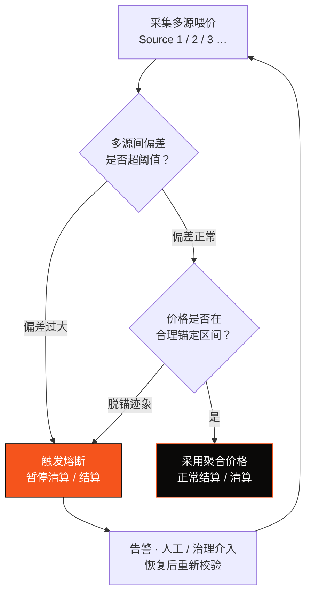

# 3.5 稳定币与喂价：多源校验与熔断

## 喂价：支付链的隐形命门

一条 PayFi 链需要不断回答一个问题：**「1 单位稳定币现在值多少法币？」** 这个看似简单的问题，是整条链的隐形命门。因为货币市场的清算、信贷的抵押率、风险准备金的计提，全都依赖这个价格。

喂价（price feed / oracle）一旦出错，后果是灾难性的：一个错误的价格可能触发本不该发生的清算，而清算又会引发连锁反应——这是 DeFi 历史上多次「喂价攻击」与「脱锚踩踏」的根源。**对一条承载真实资金的支付链，喂价安全不是可选项，而是生死线。**

## 三层防线

AXON 在喂价与稳定币锚定上设三层防线：

* **多源校验**——法币锚定价格不依赖单一来源，而是从多个独立喂价源交叉校验，防止单点被操纵或失效。
* **偏差熔断**——当各喂价源之间、或喂价与合理区间之间出现异常偏差时，系统触发熔断，暂停相关的清算 / 结算动作，而不是盲目按错误价格执行。
* **脱锚保护**——当稳定币本身出现脱锚迹象时，触发保护机制，避免在异常锚定下发生连锁清算。

## 喂价熔断的决策流

把这套逻辑画成决策流，它是一个「宁可暂停，不可算错」的保守设计：

这个流程体现的设计哲学与 [3.4](3-4-payment-finality.md) 一脉相承：**面对不确定，宁可保守暂停，也不冒险算错。** 一次不该发生的清算所造成的信任损害，远大于一次短暂暂停的不便。对支付基础设施，稳健优先于激进。

## 稳定币策略：多资产、可扩展

AXON 的稳定币策略遵循几条原则：

* **多资产**——不绑定单一稳定币，而是设计为可接入多种主流合规稳定币，降低对单一发行方的依赖；
* **法币锚定优先**——首发聚焦法币（尤其美元）锚定的稳定币，因为它们是当下跨境支付与结算的主力；
* **可插拔喂价**——喂价源设计为可插拔、可扩展，以便随着生态成熟接入更多独立、高质量的价格源（预言机合作见 [6.3](../part6-roadmap/6-3-team-partners.md)）。

喂价安全与稳定币锚定，是 PayFi 货币市场（[4.2](../part4-payfi/4-2-money-market.md)）能够安全运转的前提——没有可信的价格，就没有可信的信贷与清算。

---

*延伸阅读：[3.6 可插拔合规网关](3-6-compliance-gateway.md) · [4.2 PayFi 货币市场](../part4-payfi/4-2-money-market.md)*
