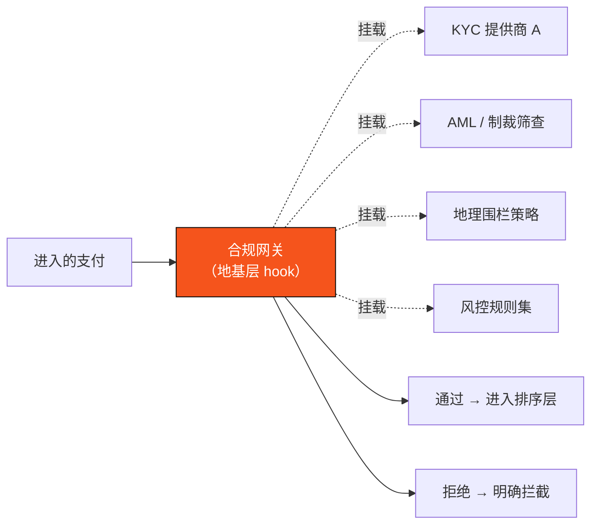

# 3.6 可插拔合规网关

## 支付基础设施绕不开合规

DeFi 可以在「无需许可」的理想里运行，但**支付基础设施绕不开合规**。一旦你要承载真实的跨境货款、商户收单、企业结算，你就必然要面对 KYC/AML、制裁名单、地理管辖、Travel Rule 等一整套现实世界的规则。

问题不是「要不要合规」，而是「合规放在哪一层」。这里有两条路：

* **应用层打补丁**——每个应用各自实现合规逻辑。结果是口径不一、重复造轮子、且容易被绕过。
* **地基层原生**——把合规能力做进链的接入层，统一、可插拔、可审计。

AXON 选择后者：**可插拔合规网关（pluggable compliance gateway）。**

## 网关的职责

合规网关位于五层架构的最顶层（[3.2](3-2-layered-architecture.md) 的第①层），是支付进入系统的第一道门。它承担：

| 能力 | 作用 |
| --- | --- |
| **Auth 认证** | 验证发起方身份 |
| **KYC/AML 可插拔** | 对接第三方合规服务，按需挂载身份与反洗钱检查 |
| **风控预审** | 在交易执行前进行风险评估与拦截 |
| **地理围栏** | 按法域限制特定功能 / 资产的可用性 |
| **限流** | 防止滥用与异常流量 |
| **Paymaster 费用代付** | 在合规通过的前提下代付 gas，顺滑体验 |

## 为什么是「可插拔」

「可插拔」是这套设计的关键词。合规不是一套放之四海皆准的固定规则——**不同法域、不同业务、不同资产，合规要求截然不同。** 一个在新加坡做跨境汇款的场景，和一个在拉美做商户收单的场景，需要的 KYC 等级、制裁筛查、地理限制都不一样。

因此 AXON 把合规设计成**可插拔的模块**：

* 合规能力作为链层的 **hook（挂载点）**，第三方合规服务商可以按需接入；
* 不同的业务场景可以配置不同的合规策略组合；
* 所有合规决策都在统一的入口发生，可审计、可追溯，不会被应用层绕过。

## 加密友好辖区与分阶段落地

AXON 的合规策略遵循务实的分阶段原则：

* **首发聚焦稳定币合规口径**——KYC/AML + 地理围栏 + 加密友好辖区，服务已经相对清晰的稳定币支付 / 结算场景；
* **面向 TradFi 的扩展**（[6.1](../part6-roadmap/6-1-roadmap.md) 的 P3+）走**更严格**的合规路径，因为传统金融资产的监管门槛远高于稳定币支付；
* **合规能力随生态演进**——可插拔架构让 AXON 能够随着进入新法域、新场景，灵活挂载对应的合规模块。

把合规做进地基，不是为了「更严」，而是为了让**合规成为支付体验的一部分，而非事后的摩擦**。这是 PayFi 能够真正对接实体商业的前提。

---

*延伸阅读：[3.7 账户抽象、会话密钥与 Paymaster](3-7-account-abstraction.md) · [3.5 稳定币与喂价](3-5-oracle-safety.md)*
