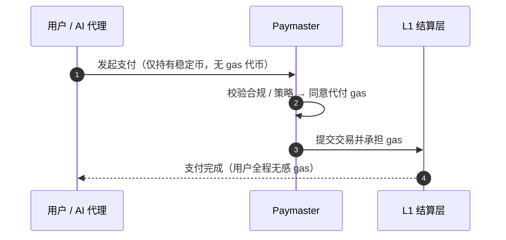

# 3.7 账户抽象、会话密钥与 Paymaster

本节介绍三个把 AXON 与通用链区分开来的地基级原语。它们既是顺滑支付体验的基础，也是 [Part V · AI 原生](../part5-ai/README.md) 的技术前提——正是这三个原语，让「给 AI 代理设可控授权」从口号变成可实现的机制。

## 账户抽象：让账户可编程

在传统区块链里，账户分两种：由私钥直接控制的「外部账户」，和由代码控制的「合约账户」。用户账户就是「一把私钥」——它能做什么、由谁授权、按什么规则，全部写死。

**账户抽象（Account Abstraction）** 打破这个僵化模型：让账户本身变成**可编程的**。一个账户可以定义自己的验证逻辑、授权规则、恢复机制。这带来一系列支付友好的能力：

* **灵活的授权**——一个账户可以授予多把有不同权限的密钥，而非只有「全有或全无」的一把私钥；
* **社交恢复**——丢失密钥不等于丢失资产；
* **批量与条件执行**——支付可以按预设条件自动触发。

在 AXON 里，**账户抽象是一等公民，而非靠合约模拟**——这是「AI 原生」的地基（见 [3.1 理由二](3-1-why-own-l1.md)）。

## 会话密钥：有界、可撤销的授权

账户抽象之上，最关键的原语是**会话密钥（session keys）**。

会话密钥是一把**有界的、临时的、可撤销的**密钥——它不是账户的主私钥，而是主账户授予某个特定用途的「受限通行证」。你可以给它设定严格的边界：

* **限额**——最多能花多少；
* **限时**——在什么时间窗口内有效；
* **白名单**——只能付给哪些对象；
* **可撤销**——随时可以吊销，立即失效。

这正是把 AI 代理安全地接进支付的钥匙。你给一个 AI 代理签发一把会话密钥，就等于告诉它：「你可以在这个额度、这段时间、这些对象范围内自主付款——**但超出边界一步都不行，而且我随时能收回。**」

一段示意性的授权可以是这样：

```javascript
// 示意伪代码：为一个 AI 代理签发受限会话密钥
grantSessionKey({
  agent:      "agent://travel-booker",   // 被授权的代理
  maxSpend:   { amount: 200, asset: "USDC" }, // 限额：最多 200 USDC
  window:     { from: now, to: now + 24*3600 }, // 限时：24 小时
  allowlist:  ["merchant://airlines", "merchant://hotels"], // 白名单
  perTxCap:   { amount: 50, asset: "USDC" }, // 单笔上限
  revocable:  true,                       // 可随时撤销
})
```

会话密钥的完整生命周期、以及它如何在链层被强制执行，是 [5.2 可控支付执行](../part5-ai/5-2-controlled-execution.md) 的主题。

## Paymaster：让用户无需持有 Gas

支付体验的最后一道摩擦，是 gas。在通用链上，用户要动用自己的稳定币，得先持有该链的原生代币来付 gas——这对新用户是巨大的门槛，对 AI 代理更是不必要的复杂度。

**Paymaster（费用代付）** 消除这道摩擦：它允许由第三方（如应用方、商户、或协议本身）**代付交易的 gas 费用**，用户 / 代理无需持有原生 gas 代币即可完成支付。



这带来的体验飞跃是：**支付可以像 Web2 一样顺滑**——用户只关心「付了多少稳定币」，而不必理解、更不必持有一种叫 gas 的代币。对 AI 代理经济更是关键：一个按调用付费的代理，不应该还要额外管理一个 gas 代币的余额。

## 三原语如何协同

这三个原语层层递进，共同构成 AXON 的「AI 原生」地基：

| 原语 | 解决的问题 | 对 AI 代理的意义 |
| --- | --- | --- |
| 账户抽象 | 账户僵化、不可编程 | 让「可控授权」在账户层成为可能 |
| 会话密钥 | 授权是「全有或全无」 | 给代理有界、可撤销的付款权 |
| Paymaster | 用户必须持有 gas | 代理无需管理 gas，专注支付本身 |

有了这三个地基原语，我们就可以进入 [Part IV](../part4-payfi/README.md) 与 [Part V](../part5-ai/README.md)，看它们如何撑起 PayFi 的四大场景与 AI 原生的可控支付执行。

---

*延伸阅读：[Part IV · PayFi 引擎](../part4-payfi/README.md) · [5.2 可控支付执行](../part5-ai/5-2-controlled-execution.md)*
