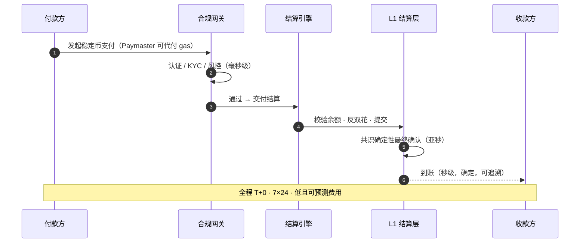

# 4.1 稳定币即时结算 Rail

## 地基场景

在 PayFi 的四大场景中，**稳定币即时结算 Rail 是地基**——它不产生最花哨的收益故事，却承载着其它一切。货币市场需要它来清算，跨境需要它来到账，AI 代理需要它来付款。把这条 rail 做到极致确定、极致顺滑，是 PayFi 一切价值的前提。

它的产品承诺可以浓缩为三个词：**T+0、7×24、秒级到账。**

## 与传统结算的对比

把这条 rail 和传统结算并排看，差异一目了然：

| 维度 | 传统结算（电汇 / 卡组织） | AXON 稳定币结算 Rail |
| --- | --- | --- |
| 到账时间 | T+1 ~ T+5（跨境更慢） | **T+0，秒级** |
| 运行时间 | 工作日 / 银行营业时间 | **7×24，无休** |
| 清算方式 | 多跳代理行接力 | **链上单跳直接结算** |
| 资金占用 | nostro 预筹资金大量沉淀 | **无需预筹，资金即时可用** |
| 成本 | 固定费 + 汇兑加价，不透明 | **低且可预测，全程透明** |
| 可编程 | 几乎不可编程 | **原生可编程、可组合** |
| 确定性 | 依赖对账，可能出错 | **确定性最终性，不可双花** |

## 一笔即时结算的旅程

这条旅程复用了 [3.2 五层架构](../part3-architecture/3-2-layered-architecture.md) 的全部地基能力：合规在网关完成、确定性在排序与共识层保证、gas 摩擦被 Paymaster 消除。**结算 rail 不是一个孤立的产品，而是地基能力的第一个、也是最基础的兑现。**

## 为什么「地基场景」如此重要

在产品设计里有一条朴素的道理：**最底层的能力必须最可靠，因为所有上层都压在它身上。** 如果结算 rail 偶尔算错钱、偶尔延迟、偶尔费用暴涨，那么建立在其上的货币市场、信贷、AI 代理支付都会继承这些不确定性。

所以 AXON 的顺序是明确的（见 [6.1 路线图](../part6-roadmap/6-1-roadmap.md)）：**先把结算 rail 的确定性打磨到极致**（P0 测试网的目标就是「消灭算错钱 / 双花 / 可被刷」），再在其上叠加更复杂的 PayFi 场景。地基不稳，高楼不立。

## 承载谁

这条 rail 的服务对象是广谱的：

* **个人**——跨境汇款、日常支付；
* **商户**——收单结算、即时到账；
* **企业**——B2B 货款、供应链结算；
* **AI 代理**——机器对机器的微支付（见 [Part V](../part5-ai/README.md)）。

它们付款的理由各不相同，但需要的东西是一样的：**一笔钱，快速、确定、低成本地，从 A 到 B。** 这就是稳定币即时结算 Rail 存在的全部意义。

---

*延伸阅读：[4.2 PayFi 货币市场](4-2-money-market.md) · [4.3 跨境 B2B 与商户收单](4-3-crossborder-b2b.md)*
