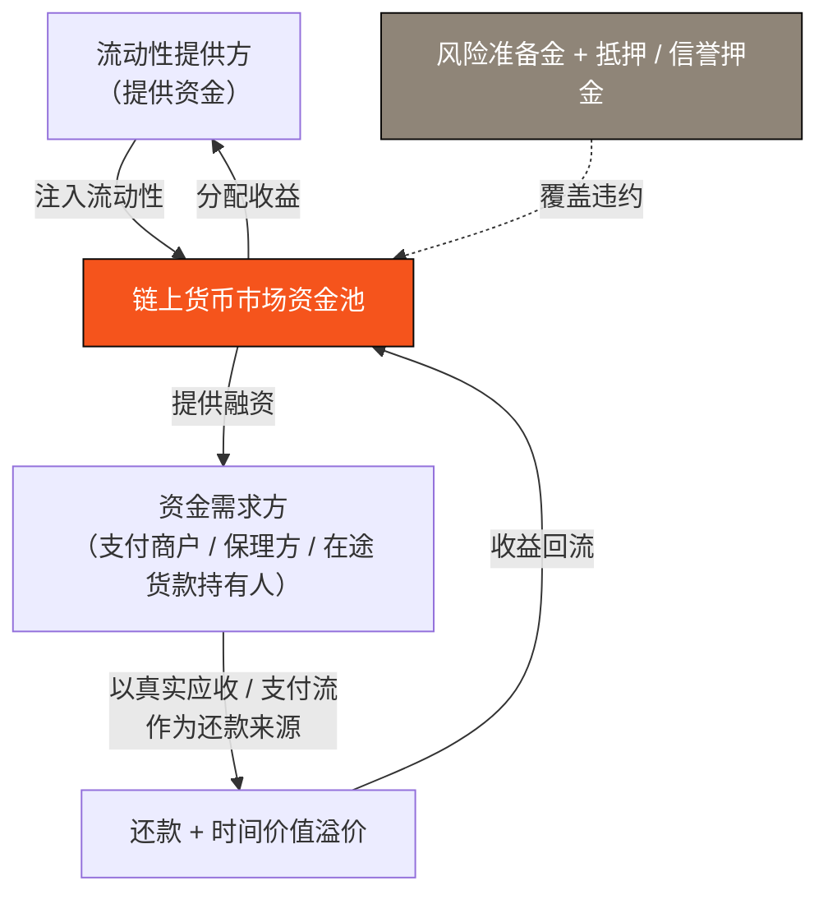

# 4.2 PayFi 货币市场：浮存金与链上信贷

## PayFi 的超额收益从哪来

结算 rail（[4.1](4-1-settlement-rail.md)）解决了「钱怎么快速、确定地流动」。但支付网络真正的超额价值，藏在钱流动的**间隙**里——那些「已经发生、但尚未清算」的资金。

想想这些场景：

* 一笔跨境货款，在途需要几天才清算；
* 一张 30 天、60 天账期的应收账款，等待买方付款；
* 一笔信用卡消费，在商户收到钱之前有一段结算前的浮存期。

在这些间隙里，**资金以「在途资金、应收账款、浮存金（float）」的形态沉睡着**——它们本可以产生收益，却因为传统体系的低效而被浪费。**PayFi 货币市场，就是把这些沉睡的资金唤醒，用链上货币市场捕获它们的时间价值。** 这正是 PayFi 相对纯粹「转账」的超额收益来源，也是 [Huma](../part2-market/2-2-payfi-thesis.md) 跑出 $10B+ 真实现金流所验证的模型。

## 一点金融背景：应收账款融资与营运资金

这套逻辑并非加密世界的发明，它对应着一门古老而庞大的传统金融业务——**应收账款融资（receivables financing）** 与 **营运资金融资（working capital financing）**。

现实中，一家企业发货后，往往要等 30–90 天才能收到货款。但企业不能干等——它需要现金去采购原料、支付工资、继续经营。于是它把「未来会收到的应收账款」拿去融资：以一定折价，提前拿到现金。这就是**保理（factoring）** 与 **贸易融资（trade finance）** 的核心。为这段「时间」提供资金的一方，赚取的正是货币的时间价值。

这是一个数以万亿计的成熟市场，但它长期被传统金融机构垄断，流程繁琐、门槛高、透明度低。**PayFi 货币市场要做的，是把这门生意搬上链**——用链上货币市场高效、透明、可组合地为支付链路的时间价值定价。

## 货币市场的资金流（设计模型）

一个 PayFi 货币市场，本质上是把「资金提供方」与「资金需求方」在链上撮合起来：

* **流动性提供方（LP）** 注入资金，赚取来自真实支付流的收益；
* **资金池** 在链上撮合供需，透明、可审计；
* **资金需求方** 用真实的应收账款 / 支付流作为还款来源，提前获得现金；
* **还款** 携带时间价值溢价回流资金池，分配给 LP；
* **风险准备金 + 抵押 / 信誉押金** 作为违约的第一道缓冲。

## 风控：机制的生死线

信贷业务的成败，从来不在「怎么放款」，而在「怎么管风险」。PayFi 货币市场的风控框架（设计方向）包含几道防线：

| 风控层 | 设计方向 |
| --- | --- |
| **还款来源真实性** | 融资绑定真实应收 / 支付流，而非凭空信用——现金流自偿是第一道防线 |
| **抵押与信誉押金** | 资金需求方 / 参与节点锁定押金，作恶则罚没（见 [3.7 会话密钥](../part3-architecture/3-7-account-abstraction.md) 的授权边界思路） |
| **喂价与估值安全** | 依托 [3.5](../part3-architecture/3-5-oracle-safety.md) 的多源校验与熔断，防止错误估值触发连锁清算 |
| **风险准备金** | 链层计提的准备金，作为违约损失的缓冲垫 |
| **违约处置瀑布** | 明确的清偿顺序：押金 → 准备金 → 逐级吸收损失，保护 LP 本金 |

## 收益从何而来：可持续的现金流

PayFi 货币市场收益的**正当性**，是它区别于旁氏结构的根本。它的收益不来自新入场者的资金，而来自**真实的货币时间价值**：

* 资金需求方愿意为「提前拿到现金」支付溢价——这个溢价是真实的商业价值；
* 这个溢价的定价原理，就是货币的时间价值（现值、贴现、浮存金收益），我们在 [4.4](4-4-time-value-of-money.md) 用金融学公式讲透；
* 只要底层是真实的支付流与应收账款，收益就有可持续的现实来源。

**这是 PayFi 最重要的品质：它的收益扎根于实体经济的现金流，而非加密内部的零和博弈。** 这也是为什么在一个越来越只为真实现金流买单的市场里，PayFi 货币市场是 AXON 最具想象力的价值引擎。

---

*延伸阅读：[4.4 货币时间价值的金融学](4-4-time-value-of-money.md) · [3.5 稳定币与喂价](../part3-architecture/3-5-oracle-safety.md)*
