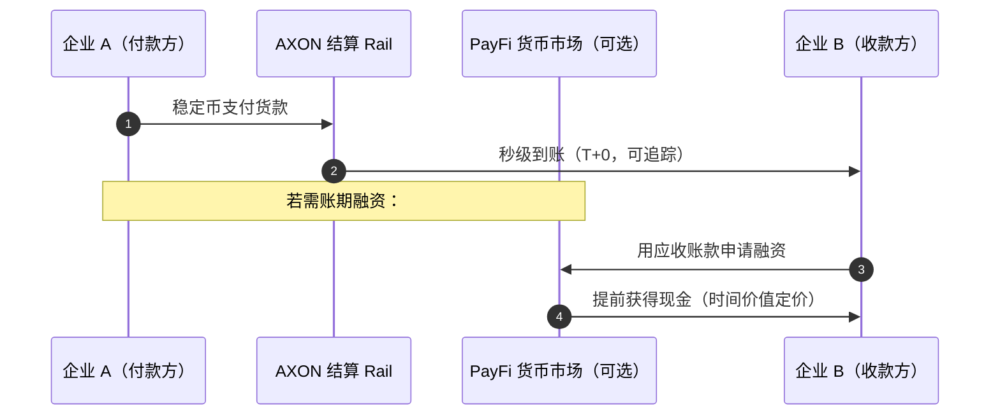

# 4.3 跨境 B2B 与商户收单

## 让 PayFi 走进实体商业

结算 rail 是地基，货币市场是引擎，而**跨境 B2B 与商户收单**是 PayFi 真正触达实体商业的地方。这是把「链上支付」从加密世界带进日常商业的关键场景——中小企业的跨境货款、商户的日常收单、平台的批量结算。

## 场景一：跨境 B2B 结算

如 [2.3](../part2-market/2-3-crossborder-pain.md) 所述，传统跨境 B2B 支付被代理行体系拖累——T+2~5、多重费用、预筹资金占用、不透明。对一家做进出口的中小企业，这意味着现金流被长期压在「在途」状态，融资成本高企。

AXON 的稳定币 rail 把这条链路重构为单跳直达：

* **即时清算**——货款秒级到账，不再被压在多跳清算里；
* **可选融资**——收款方可把应收账款接入 [PayFi 货币市场](4-2-money-market.md)，提前拿到现金；
* **全程透明可追踪**——每一笔都可审计，对账成本大幅降低。

这对中小企业的意义是实质性的：**跨境不再是大企业的特权，一个链上地址就能接入全球结算网络。**

## 场景二：商户收单

商户收单是把支付带到「最后一公里」——消费者付款、商户收款的日常场景。传统收单链条冗长（消费者 → 发卡行 → 卡组织 → 收单行 → 商户），费率高、结算慢（商户往往 T+1 甚至更久才拿到钱）。

AXON 的商户收单方案（设计方向）主打：

| 能力 | 价值 |
| --- | --- |
| **即时结算** | 商户交易完成即到账，改善现金流 |
| **低且可预测费率** | 收单成本透明、可控（见 [3.3](../part3-architecture/3-3-consensus-finality.md) 的可预测费用模型） |
| **法币出入金通道** | 商户可在稳定币与本地法币之间顺畅转换 |
| **Paymaster 顺滑体验** | 消费者无需持有 gas 代币即可付款（见 [3.7](../part3-architecture/3-7-account-abstraction.md)） |

## 法币出入金：连接两个世界

跨境与收单场景都绕不开一件事：**法币与稳定币之间的桥（on/off-ramp）。** 商户最终往往要把稳定币换成本地法币发工资、交税；消费者可能要用法币购入稳定币。

AXON 的设计把法币出入金通道作为 PayFi 生态的重要一环——通过合规的出入金伙伴，让稳定币 rail 能与现实世界的法币体系顺畅衔接。**没有顺畅的法币桥，链上支付就只是一座孤岛；有了它，PayFi 才能真正嵌入实体商业的血脉。**

## 层层叠加的价值，在此闭环

到这里，PayFi 四大场景的价值叠加完成了闭环：

* **结算 rail**（[4.1](4-1-settlement-rail.md)）提供确定性的支付轨道；
* **货币市场**（[4.2](4-2-money-market.md)）捕获时间价值、提供融资；
* **跨境 B2B 与商户收单**（本节）把这一切带进真实的商业交易；
* 而 **AI 代理支付**（[Part V](../part5-ai/README.md)）将成为贯穿其中的、机器时代的支付方式。

一条 rail 打底，四个场景层层叠加价值——这就是 PayFi 引擎的全貌。

---

*延伸阅读：[4.4 货币时间价值的金融学](4-4-time-value-of-money.md) · [Part V · AI 原生](../part5-ai/README.md)*
