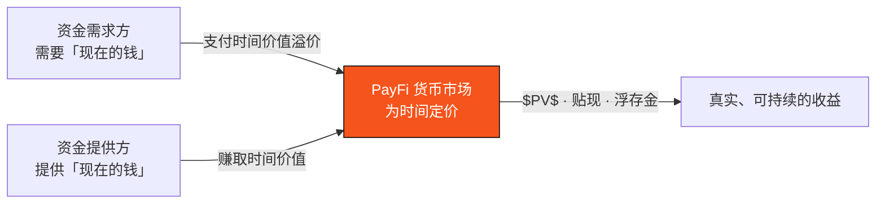

# 4.4 货币时间价值的金融学

PayFi 的核心命题是「把货币的时间价值搬上链」。这一节，我们把这个「时间价值」讲透——它是金融学最古老的第一性原理，也是 PayFi 全部收益的正当性来源。

## 第一性原理：今天的一美元，比明天的更值钱

> **货币的时间价值（Time Value of Money, TVM）：同样一笔钱，越早拥有越有价值。**

为什么？因为**今天的一美元可以立即投入使用**——存入生息、投入经营、偿还债务。而明天的一美元，你在这段等待里失去了它本可以创造的价值。这个「等待的代价」，就是利率 $r$ 所度量的东西。

整个现代金融——利息、贴现、融资、保理——本质上都是在为「时间」定价。PayFi 只是把这个定价过程，从传统金融机构的黑箱里，搬到了透明、高效、可组合的链上。

## 现值与终值

TVM 最基础的两个公式，是**终值（Future Value）** 与**现值（Present Value）**。

一笔现值为 $PV$ 的钱，以利率 $r$ 经过 $n$ 期后，其终值为：

$$FV = PV \times (1 + r)^n$$

反过来，一笔 $n$ 期后才能拿到的 $FV$，折算到今天值多少？这就是**贴现（discounting）**：

$$PV = \frac{FV}{(1 + r)^n}$$

这个简单的公式，是 PayFi 货币市场的定价基石。一张 $n$ 期后到期、面值 $FV$ 的应收账款，它今天的合理价格就是 $PV$——两者之差 $FV - PV$，正是**资金提供方因为「提前给钱」而应得的时间价值回报**。

**举例**：一张 90 天后到期、面值 10,000 USDC 的应收账款，若年化贴现率为 8%，则

$$PV = \frac{10{,}000}{(1 + 0.08)^{90/365}} \approx 9{,}812 \text{ USDC}$$

资金提供方今天付出约 9,812 USDC，90 天后收回 10,000 USDC——约 188 USDC 的差额，就是这段时间价值的定价。

## 贴现：应收账款融资的定价

在贸易融资的实务里，常用一种更直接的**贴现（discount）** 定价——按面值乘以一个贴现率与时间的比例扣减：

$$P_{\text{discount}} = FV \times \left(1 - d \cdot \frac{t}{360}\right)$$

其中 $d$ 是年化贴现率，$t$ 是距到期的天数（传统惯例常用 360 天为一年）。这就是保理商为一张应收账款报价的经典公式——它把「时间」和「信用风险」一起打包进 $d$ 里。

PayFi 货币市场把这个定价过程链上化：透明的定价、可组合的资金、可审计的风险，替代了传统保理的黑箱与高门槛。

## 浮存金经济学

TVM 的另一个重要形态是**浮存金（float）**——那些「已经在你手里、但还不属于你、尚未清算」的资金。信用卡结算前、支付在途中、预付款到交付前，都存在浮存金。

一笔规模为 $\Phi$ 的浮存金，若能以年化收益率 $r$ 运用 $t$ 天，其产生的收益为：

$$Y_{\text{float}} = \Phi \times r \times \frac{t}{365}$$

浮存金经济学的威力在于**规模与周转**：单笔浮存金的时间可能很短、收益率也不高，但当一条支付网络承载了海量的、持续周转的支付流，$\Phi$ 的规模和周转频率会让 $Y_{\text{float}}$ 累积成可观的价值。这正是传统支付巨头一个长期被低估的利润来源——**而在传统体系里，这块价值大多被沉淀在 nostro 预筹资金里白白浪费掉了**（见 [2.3](../part2-market/2-3-crossborder-pain.md)）。

PayFi 货币市场要做的，就是把这块被浪费的浮存金价值，用链上货币市场重新捕获、透明分配。

## 时间套利：贸易融资的本质

把这些放在一起，PayFi 货币市场的商业本质就清晰了——它做的是一种**时间套利**：

* 一端，是**急需现金的资金需求方**（发货后等账期的企业、在途货款的持有人）——他们愿意为「提前拿到钱」支付时间价值溢价；
* 另一端，是**寻求收益的资金提供方**——他们提供流动性，赚取这份时间价值；
* PayFi 货币市场在链上撮合两端，用 $PV$、贴现、浮存金这些古老的公式为「时间」定价，透明、高效、可组合。

## 收尾：为什么这很重要

理解了 TVM，就理解了 PayFi 与旁氏结构的根本区别：**PayFi 的收益不是凭空创造的，而是为一件真实、有价值的事——「让资金提前可用」——所支付的合理对价。** 只要底层是真实的支付流与应收账款，这份收益就扎根于实体经济，可持续、可解释、经得起推敲。

这，就是「把货币的时间价值搬上链」这句话的全部分量。

---

*延伸阅读：[4.2 PayFi 货币市场](4-2-money-market.md) · [Part V · AI 原生](../part5-ai/README.md)*
