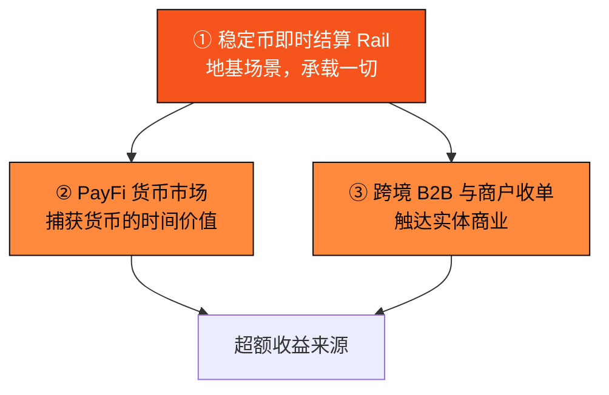

# Part IV · PayFi 引擎

> 一条支付 rail 打底，四个场景层层叠加价值。

Part III 建好了地基。本部分展示地基之上生长出的业务：**PayFi 的四大场景**。

这四个场景不是并列的四个功能，而是一个**层层叠加的价值结构**——底层是结算 rail，它承载一切；在其上叠加货币市场，捕获时间价值；再叠加跨境与商户场景，触达实体商业；而 AI 代理支付（Part V）则贯穿其中，成为机器时代的支付方式。

本部分的章节地图：

* **4.1** 稳定币即时结算 Rail —— 承载一切的地基场景。
* **4.2** PayFi 货币市场 —— 浮存金与链上信贷，PayFi 的超额收益来源。
* **4.3** 跨境 B2B 与商户收单 —— 让 PayFi 触达实体商业。
* **4.4** 货币时间价值的金融学 —— 支撑这一切的金融第一性原理。
