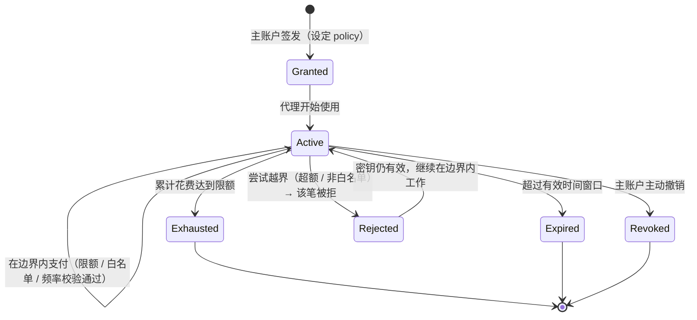
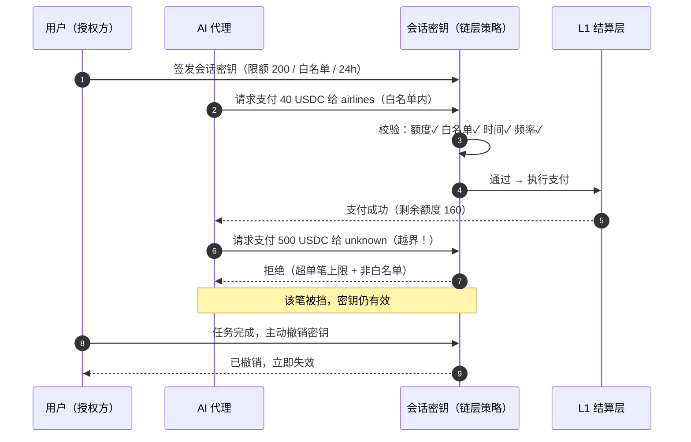

# 5.2 可控支付执行

## 一句话定义

> **可控支付执行（Controlled Payment Execution）：账户抽象 + 会话密钥 + 可验证支付策略 + 限额 / 限时 / 白名单 / 可撤销授权——让 AI 代理「能付钱、跑不了路、超不了额」。**

这是 AXON 对 [5.1](5-1-agentic-payments.md) 那个难题的完整答案。它不是一个功能，而是一套建立在 [3.7 地基原语](../part3-architecture/3-7-account-abstraction.md) 之上的授权体系。

## 授权模型：给 AI 一把「受限的钥匙」

核心思想很直观：**不要把主账户的私钥交给 AI，而是给它签发一把有严格边界的会话密钥。** 这把钥匙精确定义了「这个代理能做什么、不能做什么」：

```javascript
// 示意伪代码：为一个 AI 代理签发受限会话密钥
grantSessionKey({
  agent:      "agent://travel-booker",         // 谁被授权
  policy: {
    maxSpend:  { amount: 200, asset: "USDC" },  // 总限额：最多 200 USDC
    perTxCap:  { amount: 50,  asset: "USDC" },  // 单笔上限：50 USDC
    window:    { from: now, to: now + 24*3600 },// 限时：24 小时内有效
    allowlist: [ "merchant://airlines",         // 白名单：只能付给这些对象
                 "merchant://hotels" ],
    rateLimit: { maxTxPerHour: 10 },            // 频率限制：防失控循环
  },
  revocable:  true,                             // 可随时撤销
  auditable:  true,                             // 每一笔可追溯
})
```

这把钥匙背后是五重约束，共同构成 AI 花钱的「缰绳」：

| 约束 | 作用 | 防住的风险 |
| --- | --- | --- |
| **限额（maxSpend / perTxCap）** | 总额与单笔上限 | 失控 bug、被诱导的大额转出 |
| **限时（window）** | 有效时间窗口 | 过期密钥被复用 |
| **白名单（allowlist）** | 只能付给指定对象 | 钱被付到攻击者账户 |
| **频率限制（rateLimit）** | 单位时间笔数上限 | 循环 bug 反复付款 |
| **可撤销（revocable）** | 随时吊销、立即失效 | 代理被劫持后的止损 |

关键在于：**这些约束由链层强制执行，而非依赖代理自觉。** 即使代理被完全攻破，攻击者能造成的最大损失，也被死死锁在这把钥匙的边界之内。这就是「超不了额、跑不了路」的技术含义。

## 会话密钥的生命周期

一把会话密钥从签发到失效，走过一个严格的状态机：



注意 `Rejected` 这个状态的巧妙之处：当代理尝试一笔越界支付（比如超额、或付给白名单外的对象），**该笔支付被拒绝，但密钥本身依然有效**——代理可以继续在边界内正常工作。越界不会瘫痪代理，只会挡住那一笔危险的操作。这正是「可控」而非「一刀切」的设计。

## 一次授权支付的完整时序

把这套机制串起来，一次 AI 代理的授权支付是这样的：



## 可验证支付策略与作恶罚没

在会话密钥之上，AXON 还提供两层加固：

* **可验证支付策略沙盒（WASM）**——更复杂的支付逻辑（如「仅当满足某条件时才付款」）可以写成策略，在一个**可验证的沙盒环境**里执行（见 [3.2](../part3-architecture/3-2-layered-architecture.md) 第⑤层）。策略是确定的、可审计的——你能证明代理只会按既定策略行事。
* **信誉押金与罚没**——对于承担更高职责的参与方（如 PayFi 节点、流动性方、乃至高权限代理），可要求锁定信誉押金；一旦作恶或违约，押金被罚没。这把「行为约束」从「技术边界」延伸到「经济激励」。

## 这套设计的分量

回到 [5.1](5-1-agentic-payments.md) 的三个子问题，可控支付执行给出了完整的答案：

* **授权** → 会话密钥提供「有界」而非「全有或全无」的付款权；
* **安全** → 限额 / 白名单 / 频率由链层强制，攻破代理也超不出边界；
* **可控** → 随时可撤销，每一笔可审计追溯。

**这就是「AI 原生」的真正含义——不是给链加一个 AI 功能，而是让链的授权模型从地基起就假设：付款方可能是一台需要被约束的机器。**

---

*延伸阅读：[5.3 x402 与 M2M 微支付](5-3-x402-m2m.md) · [5.4 诚实的 AI 定位](5-4-honest-ai.md)*
