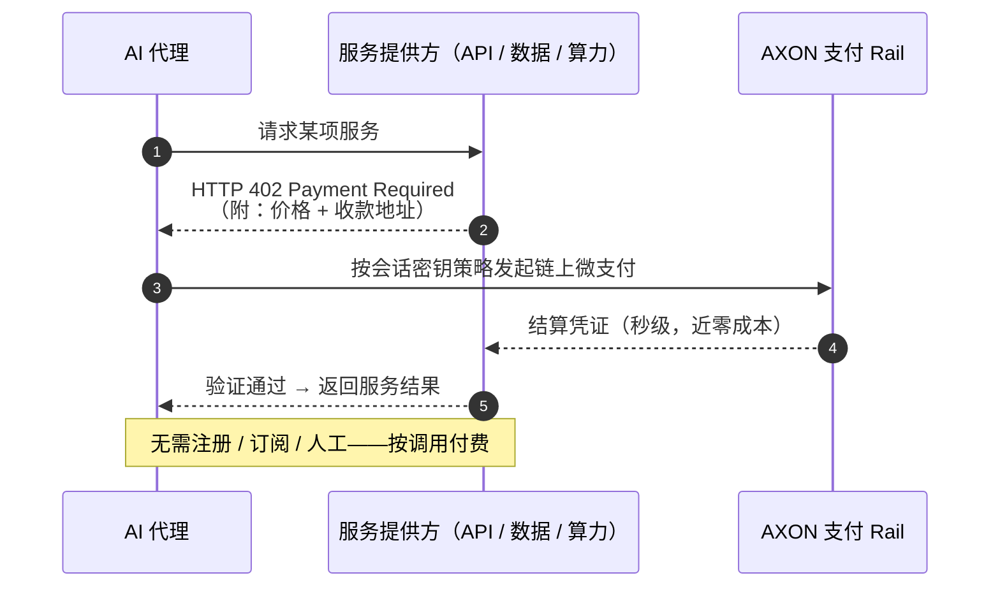

# 5.3 x402 与 M2M 微支付

## 机器经济需要一种新的支付形态

[5.2](5-2-controlled-execution.md) 解决了「如何安全地授权 AI 花钱」。本节解决另一个问题：**机器之间，究竟怎么付钱？**

人类支付和机器支付，是两种截然不同的形态：

| 维度 | 人类支付 | 机器对机器（M2M）支付 |
| --- | --- | --- |
| 频率 | 低（一天几笔） | 极高（一个任务成百上千笔） |
| 金额 | 较大 | 极微（几分之一美分） |
| 触发 | 人工点击确认 | 程序自动、按需触发 |
| 成本容忍 | 可接受几美分手续费 | 手续费必须趋近于零 |

机器经济需要的，是一种**高频、微额、自动、近零成本**的支付形态。而承载它的接口，恰好是一个沉睡了三十年的老协议。

## x402：让 HTTP 402 复活

HTTP 协议里有一个几乎从未被启用的状态码——**`402 Payment Required`（需要付款）**。它在 1990 年代就被定义，为「按次付费访问网络资源」预留，却因当时没有可用的微支付手段而长期休眠。

**x402** 就是让这个状态码复活的协议。它的逻辑优雅而简单：

* 服务方对一个请求返回 `402`，附上价格与收款地址；
* 代理在其会话密钥的策略边界内（见 [5.2](5-2-controlled-execution.md)），发起一笔链上微支付；
* 服务方验证到账后，返回结果。

整个过程**无需注册账号、无需订阅、无需人工介入**——服务真正做到了「按调用付费」，机器对机器直接结算。

## 为什么这需要 AXON 这样的链

x402 的构想很美，但它对底层链提出了苛刻的要求，而这些要求恰好是 AXON 的设计目标：



**微支付的经济学，容不下高 gas。**

如果一次 API 调用只值 0.01 美分，而链上手续费是 5 美分，那么「按调用付费」的模型根本不成立。AXON 的**亚美分级费用目标**（见 [3.3](../part3-architecture/3-3-consensus-finality.md)）正是为了让 M2M 微支付在经济上可行。



**机器支付是海量的。**

一个代理完成一个任务可能触发成百上千次付费调用；千万个代理并发，就是天文数字的支付量。AXON 的 **>10,000 TPS 设计目标**是为承载这种机器规模的流量而设。



**机器付款必须有界。**

高频自动支付若无边界，一个 bug 就能烧光余额。x402 的每一笔微支付，都在 AXON 会话密钥的**限额 / 频率 / 白名单**约束下执行（见 [5.2](5-2-controlled-execution.md)）——这是 M2M 支付安全的前提。



**代理不该管理 gas 余额。**

一个专注完成任务的代理，不应该还要维护一个原生 gas 代币的余额。AXON 的 **Paymaster 费用代付**（见 [3.7](../part3-architecture/3-7-account-abstraction.md)）让代理只需关心它要付的稳定币，gas 由第三方代付。



**近零成本、高吞吐、安全授权、gas 抽象**——这四个要求，通用链无法同时满足，而它们恰恰是 AXON 从地基设计时就锚定的目标。这就是为什么「AI 代理支付」不是一个可以外挂的功能，而是一条链的地基属性。

## M2M 微支付打开的想象空间

一旦机器能安全、近零成本地互相付费，一个全新的经济层就打开了：

* **算力按秒计费**——AI 代理按实际用量租用算力，而非包月订阅；
* **数据按条付费**——一个代理为它真正读取的每一条数据付费；
* **API 按调用结算**——服务无需构建复杂的计费系统，链上直接结算；
* **代理雇佣代理**——一个代理把子任务外包给另一个代理，并为结果付费。

这是一个**机器为机器服务、并即时结算**的经济——agentic commerce 的雏形。AXON 想成为的，正是这个机器经济的**结算层**。

---

*延伸阅读：[5.4 诚实的 AI 定位](5-4-honest-ai.md) · [3.3 共识、亚秒最终性与性能目标](../part3-architecture/3-3-consensus-finality.md)*
