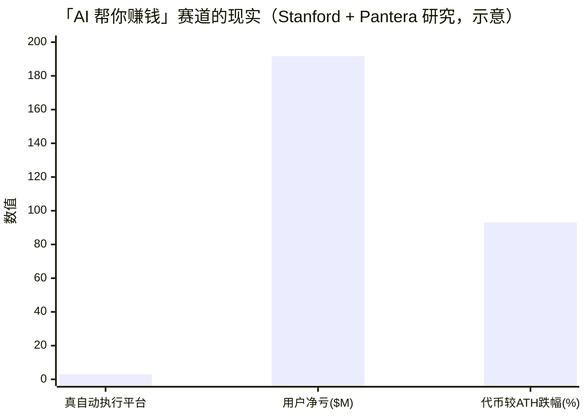

# 5.4 诚实的 AI 定位

## 一个刻意的选择

在这一轮 AI 与加密的合流里，最喧嚣的叙事是「**AI 帮你赚钱**」——AI 交易员、AI 投顾、自动生息的智能代理。这些故事激动人心，融资凶猛，代币暴涨。

AXON 刻意**不走**这条路。我们对 AI 的定位始终是克制的：**不主打「AI 替你赚钱」，而是把 AI 安全地接进支付。** 这不是保守，而是一个基于证据的判断——因为「AI 帮你赚钱」的故事，刚刚在现实里撞得粉碎。

## 现实的血泪：一份令人清醒的研究

Stanford 与 Pantera 的一项研究，扫描了 **11 个 AI 交易代理平台、约 92.5 万个钱包**，得出的结论触目惊心：

| 发现 | 数据 |
| --- | --- |
| 真正实现自动执行的平台 | **仅 3 / 11**（其余多为「AI」外壳） |
| 用户集体净亏损 | **约 $191.7M（1.917 亿美元）** |
| 相关代币从历史高点的平均跌幅 | **约 −93%** |

研究者的总结一针见血：

> *"the infrastructure needed for AI agents to trade effectively simply does not exist yet."*
> （让 AI 代理有效交易所需的基础设施，根本还不存在。）

## 这份教训教会我们什么

这份研究不是要否定 AI 与加密的结合——恰恰相反，它精确地指出了**问题出在哪里**，也因此照亮了正确的方向：

* **问题不在「AI 不够聪明」，而在「基础设施还不存在」。** 大多数「AI 交易」项目，兜售的是超出当前技术真实能力的承诺——把「AI 会帮你赚钱」当卖点，最终由用户的亏损买单。
* **真正缺的，是让 AI 安全地与钱交互的地基。** 授权、边界、可撤销、可审计——这些「无聊但关键」的基础设施，才是 AI 与金融结合的真正瓶颈。

**AXON 选择去建那个「缺失的基础设施」，而不是去兜售那个「不存在的承诺」。**

## 「可控支付执行」为什么更经得起推敲

把两条路并排看，差异不言自明：

| | 「AI 替你赚钱」路线 | AXON「可控支付执行」路线 |
| --- | --- | --- |
| **核心承诺** | AI 会帮你盈利 | AI 能安全地代你付款 |
| **依赖** | AI 的预测 / 决策能力（尚不可靠） | 授权与边界（确定、可验证） |
| **风险归属** | 用户承担 AI 决策失误的亏损 | 损失被锁在授权边界内 |
| **可证明性** | 难以证明「会赚钱」 | 可证明「超不了额、跑不了路」 |
| **经得起推敲吗** | 已被现实证伪 | 建立在确定的工程之上 |

AXON 的定位之所以「更经得起推敲」，是因为它**不对 AI 的能力做无法兑现的承诺**。我们不保证 AI 会做出好的决策——那是不可靠的；我们保证的是：**无论 AI 做什么决策，它花钱的行为都在你设定的、由链层强制的边界之内。** 这是一个确定的、可验证的、工程上可实现的承诺。

## 收束：一条更长期主义的路

在一个充斥着过度承诺的赛道里，克制本身就是一种差异化。AXON 对 AI 的定位——**可控支付执行**——或许不是最性感的故事，但它是：

* **真实的**——建立在会话密钥、限额授权这些确定的地基能力之上；
* **安全的**——把 AI 动钱的灾难面，收进可控、可撤销、可审计的边界；
* **长期的**——当 AI 代理经济真正到来时，它需要的正是这样一个可信的结算层。

> 我们不做「会赚钱的 AI」，我们做「能被信任地授权花钱的 AI 支付层」。这，就是 AXON 对 AI 的诚实定位。

---

*延伸阅读：[Part VI · 路线图与治理](../part6-roadmap/README.md) · [5.2 可控支付执行](5-2-controlled-execution.md)*
