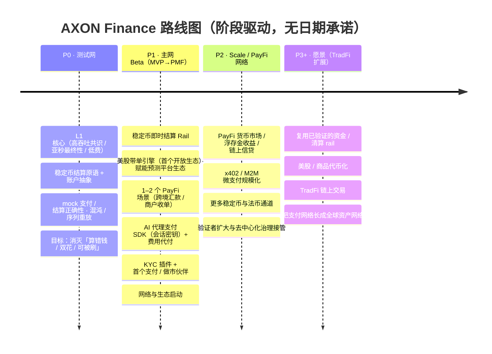

# 6.1 路线图 P0 → P3+

AXON 的路线图分四个阶段，对应 [1.1](../part1-vision/1-1-thesis.md) 的三段式演进弧——先把地基和结算 rail 跑通，再长成 PayFi 网络，最终延伸为全球资产网络。**每个阶段都有独立的退出价值。**

## 四阶段全景

## 逐阶段解读

### P0 · 测试网 —— 把确定性打磨到极致

第一阶段的目标不是华丽的功能，而是**地基的确定性**。它交付 L1 核心（高吞吐共识、亚秒最终性、低费）、稳定币结算原语与账户抽象，并通过 mock 支付 / 结算正确性测试、混沌工程与序列重放演练，反复捶打一件事：

> **消灭「算错钱 / 双花 / 可被刷」。**

这与 [3.4 支付最终性](../part3-architecture/3-4-payment-finality.md) 一脉相承——地基不稳，后面一切都是空中楼阁。**退出价值**：一条被验证过确定性的支付 L1。

### P1 · 主网 Beta —— 从 MVP 走向 PMF

第二阶段把地基兑现为可用的产品，目标是从最小可用（MVP）走向产品市场契合（PMF）：

* **稳定币即时结算 Rail** 上线（[4.1](../part4-payfi/4-1-settlement-rail.md)）；
* **美股带单引擎**上线——AXON **首个开放生态**，赋能 Polymarket、Kalshi、Kairos 等预测平台生态，用确定性稳定币收益把外部流量换成真实 TVL 与地址（[4.5](../part4-payfi/4-5-copy-trading-engine.md)）；
* **1–2 个 PayFi 场景**落地（跨境汇款 / 商户收单，[4.3](../part4-payfi/4-3-crossborder-b2b.md)）；
* **AI 代理支付 SDK**（会话密钥）+ 费用代付（[5.2](../part5-ai/5-2-controlled-execution.md)、[3.7](../part3-architecture/3-7-account-abstraction.md)）；
* **KYC 插件** + 首个支付 / 做市伙伴；
* **网络与生态启动**（[第一赛季生态开放活动](6-4-ecosystem-season.md)）。

**退出价值**：一条有真实用户、真实支付流的 PayFi 主网。

> **优先级**：带单引擎是 AXON 在 PayFi 方向的**首个开放生态（GTM 楔子）**——不是把所有场景一次铺开，而是先用一个流量、收益、闭环都能被真实验证的切口跑通「地基先行、生态切口」的战略。它逻辑上落在 P1（首发开放生态）、并在 P2 随 PayFi 网络规模化而放大。

### P2 · Scale / PayFi 网络 —— 把引擎全开

第三阶段把 PayFi 从「几个场景」扩展为「一张网络」：

* **PayFi 货币市场 / 浮存金收益 / 链上信贷**规模化（[4.2](../part4-payfi/4-2-money-market.md)）；
* **x402 / M2M 微支付**规模化（[5.3](../part5-ai/5-3-x402-m2m.md)）；
* 接入**更多稳定币与法币通道**；
* **验证者扩大、去中心化治理接管**（[6.2](6-2-governance.md)）。

**退出价值**：一张自我强化的 PayFi 网络，且治理开始去中心化。

### P3+ · 愿景 —— 从支付网络到资产网络

最后是远期愿景：在一条被真实业务验证过的支付 / 清算 rail 之上，把网络延伸到更广阔的资产世界——**美股 / 商品代币化、TradFi 链上交易**。复用已验证的资金与清算 rail，把支付网络长成**全球资产网络**。

## 为什么用阶段，而不用日期

细心的读者会注意到，本路线图**只有阶段，没有具体日历日期**。这是刻意的选择：

* 一条从地基建起的 L1，其进度取决于确定性验证、合规推进、生态成熟等多重变量，**精确到季度的日期承诺往往不切实际，甚至误导**；
* 我们更愿意用「每阶段的退出价值」来衡量进展——**做到了什么，而不是到了哪一天**；
* 阶段划分给了团队诚实推进的空间，也给了读者判断进度的清晰标尺。

**先 L1 + PayFi，TradFi 是远期愿景**——这个顺序，比任何日期都更能说明 AXON 的优先级。

---

*延伸阅读：[6.2 治理框架](6-2-governance.md) · [1.1 核心命题](../part1-vision/1-1-thesis.md)*
