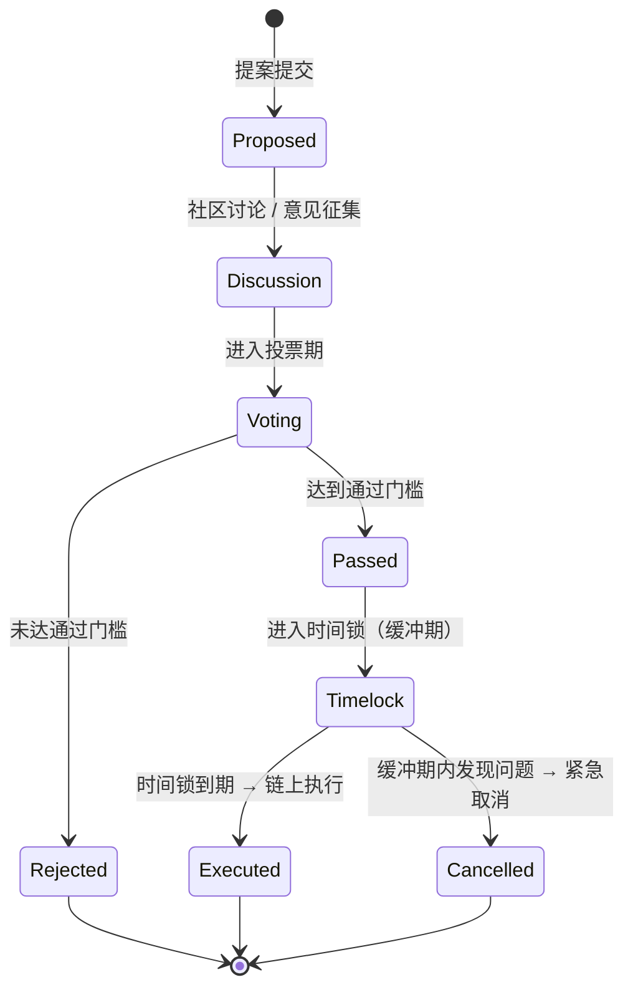
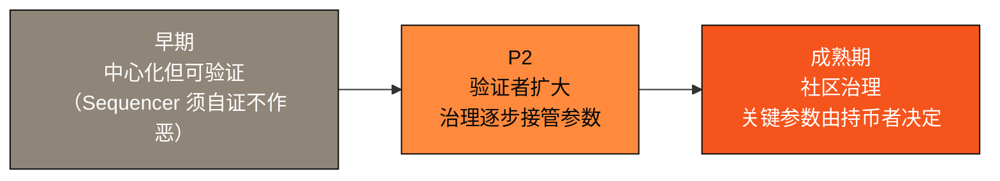

# 6.2 治理框架

## 治理的现实主义

去中心化不是一个开关，而是一段旅程。很多项目在「第一天就完全去中心化」的理想与「永远中心化」的现实之间摇摆。AXON 选择一条**务实的渐进路径**：

> **先用可验证性替代信任，再用去中心化消解信任。**

在网络早期，为了性能与快速迭代，排序器（Sequencer）与部分关键角色可能相对中心化——但即便如此，它们也必须持续提供可验证的证据（见 [3.4](../part3-architecture/3-4-payment-finality.md)）。随着网络成熟（[6.1](6-1-roadmap.md) 的 P2 阶段），验证者集合扩大，治理逐步交由社区接管。

## 治理的对象

一条 PayFi 链需要治理的，是那些影响网络运转与用户利益的**协议参数与决策**：

| 治理对象 | 说明 |
| --- | --- |
| **费率参数** | 支付 / 结算 / 信贷的费率结构 |
| **支付参数** | 结算规则、限额、风控阈值等 |
| **信贷参数** | PayFi 货币市场的风控、准备金、清算规则（[4.2](../part4-payfi/4-2-money-market.md)） |
| **合规策略** | 可插拔合规网关的策略配置（[3.6](../part3-architecture/3-6-compliance-gateway.md)） |
| **验证者与网络** | 验证者准入、去中心化推进节奏 |
| **金库与生态** | 生态资源的分配方向 |

## 治理提案的生命周期

一个健康的治理机制，需要一套清晰、可预期、有安全阀的流程。AXON 的治理生命周期（设计方向）是这样的：

这个流程里有两个关键设计：

* **讨论前置**——提案在投票前先经过公开讨论与意见征集，避免仓促决策；
* **时间锁（Timelock）**——即使提案通过，也不会立即生效，而是进入一个缓冲期。这段时间让所有利益相关方有机会审视、准备，甚至在发现严重问题时紧急取消。**时间锁是治理的安全阀**——它防止一个恶意或错误的提案在通过后瞬间造成不可逆的损害。

## 渐进去中心化的路径

AXON 的去中心化不是一步到位，而是沿路线图逐步推进：

* **早期**：中心化但可验证——用可验证性建立公信力；
* **P2**：验证者集合扩大，治理开始接管协议参数；
* **成熟期**：关键参数由社区治理决定，网络真正成为公共基础设施。

这条路径的哲学是**诚实**：我们不假装「第一天就完全去中心化」，也不满足于「永远中心化」。**去中心化是一个被兑现的承诺，而非一句开场白。**

---

*延伸阅读：[6.3 团队与资源网络](6-3-team-partners.md) · [3.4 支付最终性与反双花](../part3-architecture/3-4-payment-finality.md)*
