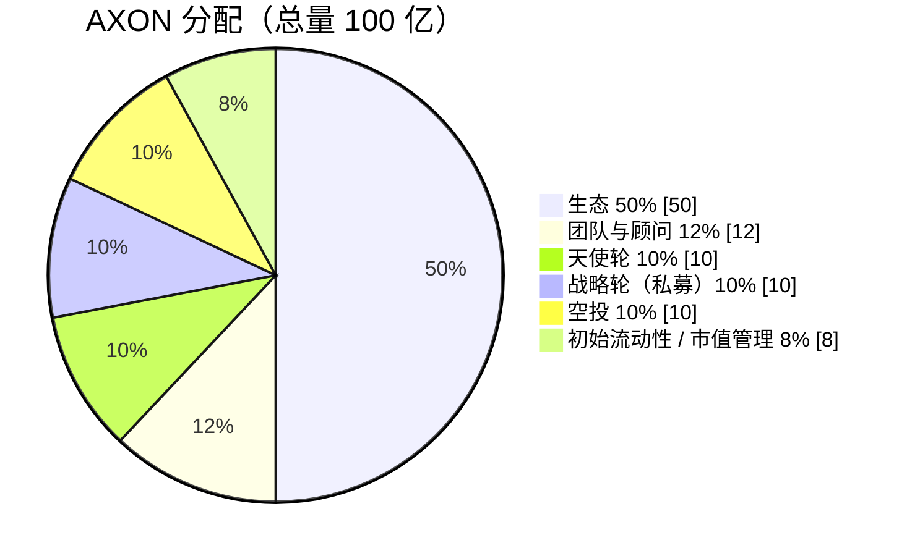

# 7.1 供应与分配

## 基础参数

| 参数 | 数值 |
| --- | --- |
| 代币符号 | **AXON** |
| 总供应量 | **100 亿**（10,000,000,000） |
| 初始价 | **$0.01** |
| 初始 FDV | **$1 亿** |
| TGE 流通占比 | **4%**（4 亿） |
| 价值捕获 | 手续费收入回购销毁（见 [7.3](7-3-utility-flywheel.md)） |

AXON 采用固定总量 100 亿的设计，初始价 $0.01、对应 FDV $1 亿。代币在 TGE（生成事件）时仅释放 **4%** 进入流通，其余按各桶解锁规则线性释放（见 [7.2 解锁与流通曲线](7-2-vesting-circulation.md)）。

## 六桶分配

100 亿总量按六个桶分配，合计 100%：

| 桶 | 占比 | 数量 | 解锁（vesting） |
| --- | --- | --- | --- |
| **生态** | **50%** | 50 亿 | TGE 3% + 60 月线性（治理可控） |
| **团队与顾问** | **12%** | 12 亿 | 锁 1 年 + 3 年线性 |
| **天使轮** | **10%** | 10 亿 | 锁 2 年 + 3 年线性（共 5 年） |
| **战略轮（私募）** | **10%** | 10 亿 | 12 月 cliff + 24 月线性 |
| **空投** | **10%** | 10 亿 | TGE 25% + 分季线性（反女巫） |
| **初始流动性 / 市值管理** | **8%** | 8 亿 | 锁 6 月，上所流动性 / 做市储备 |

**生态桶（50%）** 是最大的一桶，用于 AI 代理 / PayFi 生态、流动性激励与生态基金，由治理可控释放。它是 [6.4 第一赛季生态开放活动](../part6-roadmap/6-4-ecosystem-season.md) 项目方代币激励，以及各类生态建设的资金来源。

> **披露口径**：生态桶作为**单一整体桶（50%）**披露；其内部用途的进一步细分与更细颗粒度的释放安排，将在 TGE / 交易所上市时另行披露。

## 融资轮次（合规口径）

融资相关的桶遵循固定认购价、分轮锁仓的合规设计，**各轮为固定认购价，不承诺二级市场价格或收益**：

| 轮 | 口径 |
| --- | --- |
| **天使轮** | 10% · 锁 2 年 + 3 年线性，绑定最早期长期支持者 |
| **战略轮（私募）** | 10% · 12 月 cliff + 24 月线性，战略机构配售 |
| **初始流动性 / 市值管理** | 8% · 锁 6 月，用于上所流动性与做市 |
| **空投** | 10% · 面向活跃稳定币用户 / 支付商户 / AI 代理开发者，反女巫 |

机构与做市资源网络见 [6.3 团队与资源网络](../part6-roadmap/6-3-team-partners.md)；代币效用清单见 [7.3](7-3-utility-flywheel.md)。

---

*下一节：[7.2 解锁与流通曲线](7-2-vesting-circulation.md)*
