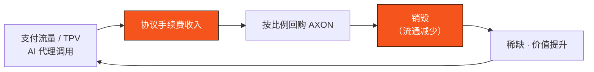

# 7.3 代币效用与通缩飞轮

## AXON 的六大效用

AXON 不是一枚纯治理或纯激励代币，它在网络里承担六项真实功能：

1. **Gas / 计算**——支付网络交易与计算的费用（[F.1 Gas 与费用市场](../yellowpaper/f1-gas-fees.md)）。
2. **质押与治理**——验证者质押作为安全押金，持币者参与治理（[6.2 治理框架](../part6-roadmap/6-2-governance.md)、[F.2 质押与罚没](../yellowpaper/f2-staking-slashing.md)）。
3. **结算 / 信誉押金**——PayFi 场景中作为结算与信誉担保的押金。
4. **手续费折扣**——用 AXON 支付可享手续费折扣，形成使用需求。
5. **风险准备金后盾**——作为货币市场与带单准备金池的风险后盾之一。
6. **回购销毁 Sink**——协议手续费收入回购 AXON 并销毁，构成代币的通缩 Sink。

## 通缩飞轮：收入即通缩

AXON 的价值捕获不依赖通胀补贴，而是一个**由真实业务驱动的通缩飞轮**：

支付流量 / TPV / AI 代理调用 → 协议手续费收入 → 按比例回购 AXON → 销毁（流通减少）→ 稀缺、价值提升。**把网络真实业务的增长铸进代币价值，而非靠通胀补贴。** 所依赖的支付场景，见 [Part IV · PayFi 引擎](../part4-payfi/README.md)。

## 与带单引擎的对接

[4.5 美股带单引擎](../part4-payfi/4-5-copy-trading-engine.md) 是这个飞轮的一个直接入口：引擎从用户收益中按比例抽成，这部分资金注入 AXON 底池——一部分随协议手续费进入回购销毁飞轮，支撑流动性与币价；一部分补充链上带单准备金池，为「保本保底」兜底。每一单真实交易，既给用户确定性收益，也把价值沉淀回 L1。

这就是 AXON 代币经济的闭环：**真实的支付与交易业务 → 真实的协议营收 → 回购销毁 → 代币稀缺 → 网络价值。**

---

*上一节：[7.2 解锁与流通曲线](7-2-vesting-circulation.md) · 延伸阅读：[3.1 为什么必须自有 L1](../part3-architecture/3-1-why-own-l1.md)*
