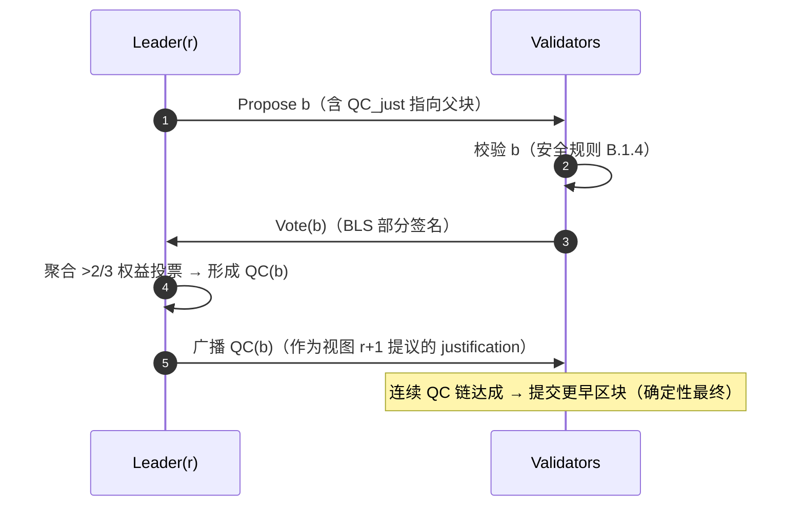

# B.1 BFT PoS 共识协议

> **设计状态**：proposed design。AXON 采用 HotStuff 风格的 pipelined BFT，具体参数（超时、pipeline 深度）待测试网基准。

## B.1.1 为什么是 BFT 而非最长链

支付要求**确定性最终性**（[A.1.4](a1-system-model.md)）。中本聪式最长链共识只提供概率最终性——交易被回滚的概率随确认数指数下降但永不归零。对支付，「几乎确定」是不可接受的。

AXON 采用 **BFT（拜占庭容错）共识**：一旦一个 quorum 确认区块，它**立即不可逆**。代价是需要已知的验证者集合与投票轮次；收益是亚秒级的绝对最终性。AXON 选择 **HotStuff 风格**的现代 BFT，因其具备**线性通信复杂度**（$O(n)$，得益于 BLS 聚合与领导者中继）与**流水线（pipelining）**，适配高吞吐。

## B.1.2 基本对象

* **视图（View）** $r$：单调递增的轮次。每个视图有唯一领导者 $\mathsf{Leader}(r)$，由 VRF 派生（[B.2](b2-validators.md)）。
* **Quorum Certificate（QC）**：对某区块 $b$ 的一组投票的聚合，其权益 $> \tfrac{2}{3}S$。记 $\mathsf{QC}(b)$。由 BLS 聚合为常数大小（[A.2.3](a2-cryptography.md)）。
* **区块** $b = (\text{parent}, \text{height}, \text{payload}, \mathsf{QC}_{\text{just}})$：每个区块携带对其父块的 QC 作为 justification，形成 QC 链。

## B.1.3 正常流程（pipelined）

每视图领导者提议一个区块，验证者投票，形成 QC；QC 又作为下一区块的 justification。**提交（commit）通过 QC 链的连续性达成**——当出现连续三个视图的直接 QC 链（$b \leftarrow b' \leftarrow b''$，视图连续）时，最前的 $b$ 被最终提交。



流水线含义：视图 $r$ 的投票形成 $b$ 的 QC，同时驱动视图 $r{+}1$ 的提议——每个消息轮次同时服务于「确认上一块」与「提议下一块」，无空转。

## B.1.4 投票安全规则

验证者维护两个状态：$\mathsf{lockedQC}$（当前锁定的最高 QC）与 $\mathsf{lastVoted}$（最近投票的视图）。收到提议 $b$ 时，**仅当**满足以下规则才投票：

```text
VOTE(b) 当且仅当：
  1.  b.view > lastVoted                      # 单调：每视图至多投一票
  2.  b 的 justification QC 指向 b.parent      # 合法扩展
  3.  b.parent.view ≥ lockedQC.view           # 安全：不背离已锁定分支
更新：lastVoted ← b.view
      若 b 的 QC 更高，lockedQC ← b 的 QC
```

规则 3（locking）是安全性的关键：一旦诚实节点锁定某分支上高度为 $h$ 的 QC，它不会再投票给绕过该分支的竞争区块。

## B.1.5 安全性论证（要点）

**命题**：在 $S_f < \tfrac{1}{3}S$ 下，两个冲突区块不可能在同一高度都获得 QC 并被提交。

**论证要点**：QC 需 $> \tfrac{2}{3}S$ 权益。若同高度存在两个冲突 QC，则两组投票权益之和 $> \tfrac{4}{3}S$，超出总权益 $S$ 的部分 $> \tfrac{1}{3}S$ 必为**同一批验证者对两个冲突区块都投了票**。由投票规则 1（每视图至多一票）与 locking 规则，诚实节点不会双投或背离锁定分支；故这批双投者全为拜占庭，其权益 $> \tfrac{1}{3}S$，与 $S_f < \tfrac{1}{3}S$ 矛盾。$\blacksquare$

这就是 [A.1.4](a1-system-model.md) 安全性性质的代数根源：**quorum 交集论证**。它不依赖任何时序假设，因此安全性在完全异步下仍成立。

## B.1.6 视图切换与活性（Pacemaker）

领导者故障或网络异步会导致视图无法推进。**Pacemaker** 机制处理超时：

```text
每个视图设超时 Δ_view（自适应，指数退避）：
  若在 Δ_view 内未见 b.view 的 QC：
     广播 TimeoutMsg(view)
  收集 >2/3 权益的 TimeoutMsg → 形成 TimeoutCertificate(TC)
  凭 TC 进入 view+1，新领导者以见过的最高 QC 提议
```

活性仅在 $t \geq \mathrm{GST}$ 后保证：同步期内，诚实领导者的提议能在超时前收齐投票，视图稳定推进。$\Delta_{\text{view}}$ 自适应增长以适配未知的 $\Delta$。

## B.1.7 最终性延迟

从提交角度，一笔交易的最终确认延迟约为：

$$T_{\text{final}} \approx k \cdot (\delta_{\text{net}} + \delta_{\text{agg}})$$

其中 $k$ 为提交所需的连续 QC 数（pipeline 深度，通常 2–3），$\delta_{\text{net}}$ 为一跳网络延迟，$\delta_{\text{agg}}$ 为聚合验证耗时。以 $k=3$、区块间隔目标 $250$–$500\,\mathrm{ms}$ 计，最终性目标落在**亚秒级（$<1\mathrm{s}$）**（[G.2](g2-performance.md) 给出完整推导）。

---

*下一节：[B.2 验证者集合与区块生产](b2-validators.md)*
