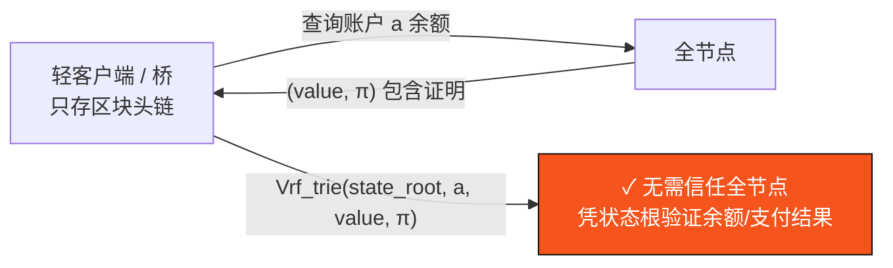

# B.3 状态模型与状态承诺

> **设计状态**：proposed design。账户模型为 account-based，字段可随执行层设计调整。

## B.3.1 账户模型

AXON 采用 **account-based 状态模型**（相对 UTXO），因其天然适配可编程账户、会话密钥授权与稳定币余额语义。全局状态是账户地址到账户对象的映射：

$$\mathsf{st} : \mathsf{Addr} \to \mathsf{Account}$$

账户对象定义（完整数据结构见 [附录 III](appendix-datastructures.md)）：

```text
Account := {
  nonce      : u64          // 反重放计数器
  balances   : Map<AssetId, u128>   // 多资产余额（原生 + 稳定币）
  verifier   : VerifierRef  // 验证逻辑（默认 Ed25519，或自定义，见 C.1）
  policy_root: Hash?        // 会话密钥/授权策略承诺（见 C.2）
  code       : Hash?        // 可选：合约/策略代码承诺（WASM，见 C.3）
  storage_root: Hash?       // 可选：账户存储子树根
}
```

`balances` 是多资产映射——稳定币是链层的一等余额，而非某个合约内的记账（[D.1](d1-settlement.md)）。

## B.3.2 状态转换函数

区块的执行由确定性状态转换函数 $\delta$ 定义：

$$\mathsf{st}' = \delta(\mathsf{st}, b) = \delta(\dots \delta(\delta(\mathsf{st}, \mathsf{tx}_1), \mathsf{tx}_2)\dots, \mathsf{tx}_m)$$

即按区块内交易的 `seqNo` 顺序逐笔应用单交易转换 $\delta_{\mathsf{tx}}$。**$\delta$ 是纯确定性的**：给定相同 $(\mathsf{st}, b)$，任意节点计算出完全相同的 $\mathsf{st}'$——这是可重放性（[B.4](b4-sequencing.md)）与状态根一致性的前提。

单交易转换的骨架：

```text
δ_tx(st, tx):
  assert st[tx.sender].nonce == tx.nonce          # 反重放
  assert Verify(st[tx.sender], tx)                # 授权（C.1/C.2）
  assert 授权策略谓词 Auth(tx) == true             # 会话密钥边界（C.2）
  charge_gas(tx)                                   # 计费（F.1；Paymaster 见 C.3）
  apply_effects(st, tx)                            # 转账/结算/合约调用
  st[tx.sender].nonce += 1
  return st'
```

任一 assert 失败 → 交易被拒（不改变状态，仅可能扣除已消耗 gas），进入 `Rejected` 终态（[B.5](b5-finality.md)）。

## B.3.3 状态承诺与状态根

执行后的状态被承诺为 Merkle 树根（[A.2.4](a2-cryptography.md)）：

$$\mathsf{root}(\mathsf{st}') \in \{0,1\}^{256}$$

写入区块头。由于 $\delta$ 确定，诚实验证者对同一区块计算出相同 $\mathsf{root}(\mathsf{st}')$；共识对区块头的 QC 因而也**认证了状态根**——一个区块获得 QC，即等于超过 $\tfrac{2}{3}S$ 权益背书了「执行此区块后状态根为此值」。

## B.3.4 可证明性

状态根的价值在于**可证明性**：



轻客户端仅需跟踪区块头链（含状态根 + QC），即可用一份 $O(\log |\mathsf{st}|)$ 大小的包含证明验证任意账户余额或某笔支付是否已结算——无需信任任何单一全节点。这支撑了跨链桥、二层与外部审计的**无信任验证**。

## B.3.5 状态膨胀治理

account-based 模型的状态会随账户增长。AXON 的设计对策（proposed）：

* **存储租金 / 休眠归档**：长期不活跃账户的存储子树可被归档，凭证明按需复活（state expiry 思路）。
* **Verkle-ready**：预留迁移向量承诺的接口，将证明体积从 $O(\log n \cdot 32\text{B})$ 压到近常数，为无状态验证（stateless clients）铺路。

具体归档策略与租金参数待定（[附录 II](appendix-parameters.md)）。

---

*下一节：[B.4 排序层、Entry-Log 与确定性执行](b4-sequencing.md)*
