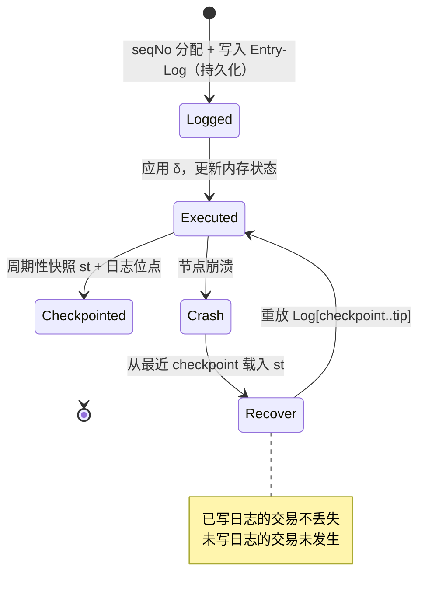

# B.4 排序层、Entry-Log 与确定性执行

> **设计状态**：proposed design。排序器早期中心化但可验证，随 P2 去中心化。

排序层是 AXON 支付确定性的心脏。它做两件看似朴素、实则关键的事：**给每笔交易一个全局唯一的序号**，并**把它写进一份不可篡改、可完整重放的日志**。

## B.4.1 全局单调序号

排序器 $\mathsf{Seq}$ 为每笔通过接入网关（[D.3](d3-compliance.md)）的交易分配全局单调递增序号：

$$\mathsf{seqNo} : \mathsf{Tx} \to \mathbb{N}, \qquad \mathsf{tx}_i \prec \mathsf{tx}_j \iff \mathsf{seqNo}(\mathsf{tx}_i) < \mathsf{seqNo}(\mathsf{tx}_j)$$

这给系统中所有交易一个**唯一的全序（total order）**。全序消除了「谁先谁后」的模糊地带，也**压缩了 MEV 空间**——排序不由出块领导者临时决定，而由排序层按到达顺序确定（[F.3](f3-security.md)）。

**排序权与出块权分离**：$\mathsf{Seq}$ 决定顺序，验证者（[B.2](b2-validators.md)）决定区块的最终性。区块只能包含 `seqNo` 的**连续区间**，无法重排或跳过——领导者拿到的是已定序的交易流。

## B.4.2 Entry-Log：预写日志

序号一经分配，交易先被写入 **Entry-Log**——一份只追加（append-only）、哈希链接的**预写日志（Write-Ahead Log, WAL）**，然后才被执行：

$$\mathsf{Log} = [\,e_1, e_2, \dots\,], \qquad e_k = \big(\mathsf{seqNo}_k,\ \mathsf{tx}_k,\ h_{k}\big),\quad h_k = H(h_{k-1} \,\|\, \mathsf{seqNo}_k \,\|\, \mathsf{tx}_k)$$

哈希链 $h_k$ 使日志**防篡改**：改动任一历史条目都会破坏其后所有哈希。WAL 是从数据库借来的、久经考验的思想——**先记录「要做什么」，再执行**。只要日志在，正确状态就永远可被重建。

## B.4.3 确定性执行与可重放

由于状态转换 $\delta$ 确定（[B.3.2](b3-state.md)），且 Entry-Log 给出唯一交易全序，**状态是日志的纯函数**：

$$\mathsf{st}_k = \delta(\mathsf{st}_{k-1}, \mathsf{tx}_k), \qquad \mathsf{st}_k = \mathsf{Replay}(\mathsf{st}_0, \mathsf{Log}[1..k])$$

**可重放性（Replayability）**：任意节点给定 $\mathsf{st}_0$ 与 $\mathsf{Log}$，重放即得到完全相同的 $\mathsf{st}_k$。这是「出错时一定能查清」的技术基础，也是不同验证者对状态根达成一致的前提。

## B.4.4 崩溃恢复

WAL 的经典价值：崩溃后恢复到一致状态。

恢复语义清晰：**已进入 Entry-Log 的交易一定被恢复；未进入的交易视为从未发生**——不存在「钱不知去向」的中间态。周期性 checkpoint（状态快照 + 日志位点）把恢复所需重放的日志长度限定在有界范围。

## B.4.5 排序器的信任最小化

早期排序器可能相对中心化（性能与迭代考量）。AXON 的硬性要求：

> **排序器即使中心化，也必须证明其日志不可篡改、且可被完整重放。**

具体机制：

* **日志承诺上链**：排序器周期性将 Entry-Log 的哈希链头 $h_k$ 提交进区块，由共识 QC 背书——事后无法悄悄改写历史。
* **公平排队证明**：对交易到达顺序可附加时间戳/收据，使「插队」可被检测。
* **可独立重放**：任何第三方持日志即可重建状态并核对状态根——排序器无法在不被发现的情况下作恶。

这是「先用可验证性替代信任，再用去中心化消解信任」的第一步。

## B.4.6 去中心化路径

按路线图 P2，排序逐步去中心化，候选方向（proposed）：

* **共享排序 / 领导者轮值**：将 $\mathsf{Seq}$ 角色轮转给验证者集合，以 VRF 防操纵。
* **加密内存池（encrypted mempool）**：交易在定序前对排序器加密（阈值解密），进一步压缩排序层的 MEV/审查能力。

最终形态以去中心化程度与性能的权衡结论为准。

---

*下一节：[B.5 支付最终性、反双花与恢复](b5-finality.md)*
