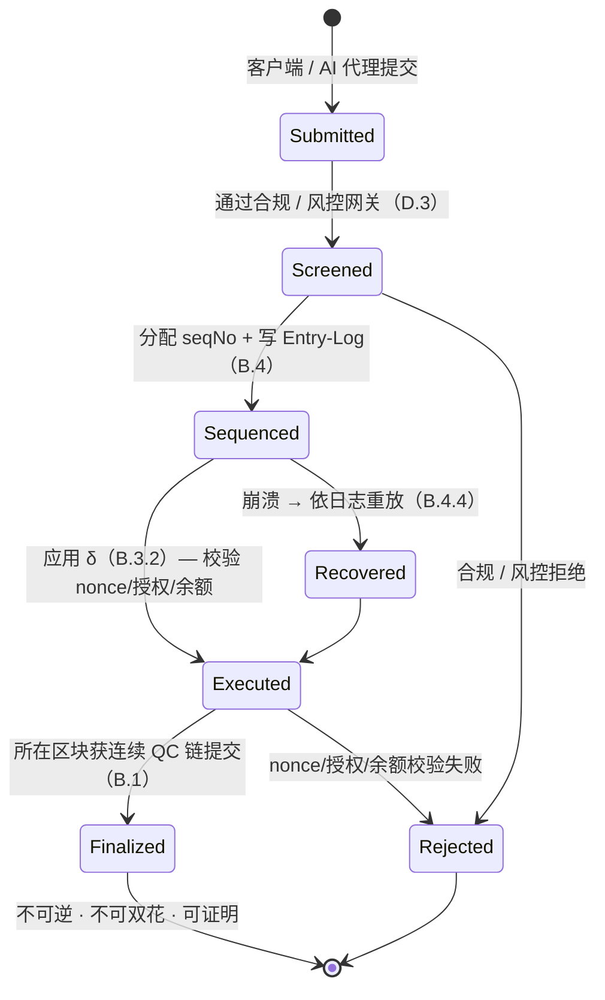

# B.5 支付最终性、反双花与恢复

> **设计状态**：proposed design。本节整合 [B.1](b1-consensus.md)/[B.3](b3-state.md)/[B.4](b4-sequencing.md) 得出支付级保证。

## B.5.1 交易生命周期状态机

一笔支付从提交到最终确认，走过一个**严格的状态机**——每一步转移都显式、可验证，没有模糊中间态：

关键：交易要么走完 `Submitted → … → Finalized` 的确定路径，要么在明确的检查点被 `Rejected`；崩溃时经 `Recovered` 回到正确状态。**没有「已扣款但状态未定」的悬空态。**

## B.5.2 反双花

双花意味着同一笔资金被两次成功花费。AXON 用**三重机制**杜绝，任一即足以阻断，三者叠加提供纵深：

1. **Nonce 单调**（[B.3.2](b3-state.md)）：账户每笔交易 `nonce` 严格递增。同一 `nonce` 的第二笔交易在 $\delta_{\mathsf{tx}}$ 的 `assert nonce` 处即被拒——重放同一笔支付不可能。
2. **全局单调 seqNo + 确定性执行**（[B.4](b4-sequencing.md)）：所有交易有唯一全序，按序执行。两笔花费同一资金的交易必有先后，后者执行时余额已被前者扣减，因余额不足而失败。
3. **确定性最终性**（[B.1](b1-consensus.md)）：一旦 `Finalized`，结果不可回滚，不存在「另一条更长的链」让已花费的资金复活。

**命题（无双花）**：设资金 $x$ 属账户 $a$。若交易 $\mathsf{tx}_1$ 花费 $x$ 且到达 `Finalized`，则任何试图再次花费 $x$ 的 $\mathsf{tx}_2$ 必到达 `Rejected`。

**论证**：由 seqNo 全序，$\mathsf{tx}_1, \mathsf{tx}_2$ 有确定先后。不失一般性设 $\mathsf{seqNo}(\mathsf{tx}_1) < \mathsf{seqNo}(\mathsf{tx}_2)$。执行 $\mathsf{tx}_1$ 后 $a$ 的相应余额减少 $x$；执行 $\mathsf{tx}_2$ 时余额校验 `balance ≥ x` 失败（若 $\mathsf{tx}_2$ 复用 nonce 则更早在 nonce 校验失败）。故 $\mathsf{tx}_2 \to$ `Rejected`。由确定性最终性，$\mathsf{tx}_1$ 的 `Finalized` 不可逆。$\blacksquare$

## B.5.3 回滚保护

概率最终性链存在「重组（reorg）」——已确认区块被更长链取代。AXON 的 BFT 确定性最终性**在协议层排除 reorg**：

$$\mathsf{Finalized}(b) \implies \nexists\, b' \neq b \text{ 在同高度被 Finalized}$$

由 [B.1.5](b1-consensus.md) 的 quorum 交集论证保证。因此支付一旦 `Finalized`，商户可**立即放货**，无需「等待 N 个确认」的概率等待——这正是支付相较通用链的体验飞跃。

## B.5.4 与外部系统的最终性桥接

法币出入金、跨链桥等需要把 AXON 的最终性传递给外部系统。凭 [B.3.4](b3-state.md) 的可证明状态根 + QC，外部系统可验证：

* 某笔支付**是否已 Finalized**（区块头 QC + 交易包含证明）；
* 某账户在某高度的**确定余额**（状态根 + 包含证明）。

无需信任任何单一节点。这为「T+0、可编程、可审计」的结算提供了可对接传统金融的最终性凭证（[D.1](d1-settlement.md)）。

## B.5.5 支付确定性总览

| 保证 | 机制 | 章节 |
| --- | --- | --- |
| 唯一全序 | 全局单调 seqNo | [B.4.1](b4-sequencing.md) |
| 可重放 / 可审计 | Entry-Log（WAL）+ 确定性 $\delta$ | [B.4.3](b4-sequencing.md) |
| 反双花 | nonce + 有序执行 + 余额校验 | 本节 |
| 不可回滚 | BFT 确定性最终性（quorum 交集） | [B.1.5](b1-consensus.md) |
| 崩溃可恢复 | checkpoint + 日志重放 | [B.4.4](b4-sequencing.md) |
| 无信任验证 | 可证明状态根 + QC | [B.3.4](b3-state.md) |

这六项共同兑现 [A.1.5](a1-system-model.md) 的支付特化目标——**支付链最难的确定性、授权与恢复，被做进了地基**。

---

*下一节：[C.1 账户抽象与交易执行](c1-account-abstraction.md)*
