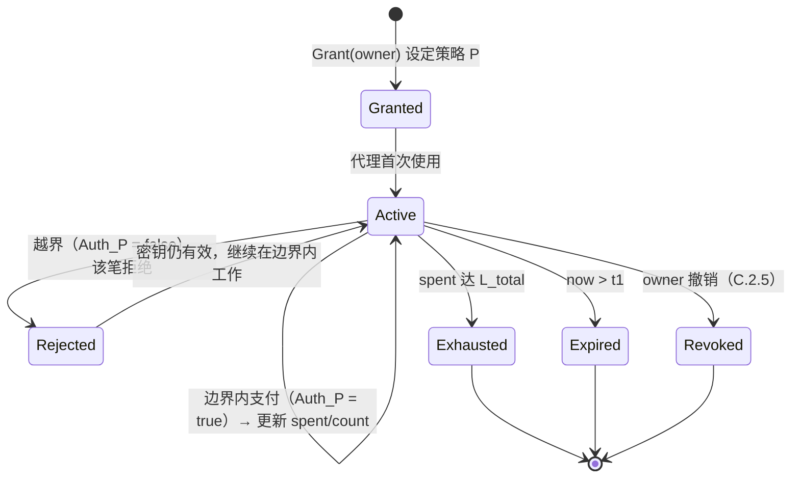

# C.2 会话密钥与授权模型

> **设计状态**：proposed design。这是 AXON「可控支付执行」的协议核心（白皮书 [5.2](../part5-ai/5-2-controlled-execution.md) 的形式化）。

## C.2.1 目标

让一个自动化主体（AI 代理）能自主发起支付，但其支付能力被**链层强制约束**在一个精确、可撤销的边界内——「**能付钱，但跑不了路、超不了额**」。核心是把「授权」从「一把全权私钥」变成「一份可编程、有界、可撤销的策略」。

## C.2.2 会话密钥与策略

账户所有者（主密钥 $sk_{\text{owner}}$）向代理签发**会话密钥（session key）** $sk_a$，并绑定一份**授权策略** $P$：

$$\mathsf{Grant}(sk_{\text{owner}}) \to (sk_a,\ P), \qquad P = \{\,c_1, c_2, \dots, c_k\,\}$$

策略 $P$ 是一组**约束谓词（constraint）**的集合。约束的承诺 $\mathsf{policy\_root} = \mathsf{root}(P)$ 写入账户（[B.3.1](b3-state.md)），使策略成为被认证的链上状态。

支持的约束类型（每个约束是一个作用于交易的谓词 $c : \mathsf{Tx} \times \mathsf{Ctx} \to \{0,1\}$）：

| 约束 | 记号 | 语义 |
| --- | --- | --- |
| 总限额 | $c_{\text{cap}}$ | 会话累计花费 $\leq L_{\text{total}}$ |
| 单笔上限 | $c_{\text{tx}}$ | 单笔金额 $\leq L_{\text{tx}}$ |
| 时间窗 | $c_{\text{time}}$ | $t \in [t_0, t_1]$ |
| 白名单 | $c_{\text{allow}}$ | 收款方 $\in W$ |
| 资产范围 | $c_{\text{asset}}$ | 资产 $\in \mathcal{S}$ |
| 频率限制 | $c_{\text{rate}}$ | 单位时间笔数 $\leq \rho$ |
| 调用范围 | $c_{\text{call}}$ | 目标/方法 $\in \mathcal{F}$ |

## C.2.3 授权谓词

一笔由会话密钥签署的交易 $\mathsf{tx}$，其授权当且仅当**所有约束同时满足**——授权谓词是约束的合取：

$$\mathsf{Auth}_P(\mathsf{tx}, \mathsf{ctx}) \;=\; \bigwedge_{c \in P} c(\mathsf{tx}, \mathsf{ctx})$$

其中上下文 $\mathsf{ctx} = (\text{now},\ \mathsf{spent},\ \mathsf{count},\ \dots)$ 携带**会话状态**：已累计花费 $\mathsf{spent}$、窗口内笔数 $\mathsf{count}$ 等。这些状态随会话使用而更新，是「累计限额」「频率限制」得以强制的关键——它们是链上认证状态，代理无法绕过或伪造。

展开为可判定的检查：

```text
Auth_P(tx, ctx):
  assert verify(session_pubkey, tx)                     # 会话密钥签名有效
  assert not revoked(session_id)                        # 未被撤销（C.2.5）
  assert t0 ≤ ctx.now ≤ t1                              # c_time
  assert tx.amount ≤ L_tx                               # c_tx
  assert ctx.spent + tx.amount ≤ L_total                # c_cap（累计）
  assert tx.recipient ∈ W                               # c_allow
  assert tx.asset ∈ S                                   # c_asset
  assert ctx.count_in_window + 1 ≤ ρ                    # c_rate
  assert tx.call ∈ F                                    # c_call
  return true    # 任一 assert 失败 → false（该笔被拒，密钥仍有效）
```

## C.2.4 会话状态机

一把会话密钥的生命周期是严格的状态机。**越界不瘫痪密钥，只挡住那一笔**——这是「可控」而非「一刀切」的设计精髓：



`Rejected` 是一个**返回态**：越界交易被拒，但会话密钥保持 `Active`，代理可继续在边界内正常工作。只有耗尽额度、超时或被撤销才终止会话。

## C.2.5 撤销

撤销必须**即时且链层生效**——这是止损的最后一道闸。撤销将会话标记写入账户状态：

$$\mathsf{Revoke}(sk_{\text{owner}}, \mathsf{session\_id}) \Rightarrow \mathsf{revoked}[\mathsf{session\_id}] \gets \top$$

一经 `Finalized`（[B.5](b5-finality.md)），后续任何该会话的交易在 $\mathsf{Auth}_P$ 的 `not revoked` 检查处立即失败。即使代理被完全攻破，所有者也能在一个区块内切断其支付能力。

## C.2.6 安全性质

会话密钥授权模型提供三条可证明的性质（对应白皮书 [5.1](../part5-ai/5-1-agentic-payments.md) 的三个子问题）：

* **有界性（Boundedness）**：会话累计支出恒有 $\mathsf{spent} \leq L_{\text{total}}$，单笔 $\leq L_{\text{tx}}$。由 $c_{\text{cap}}, c_{\text{tx}}$ 在链层强制——**攻破代理，损失也锁在边界内**。

$$\text{对任意执行序列}\ \sum_{\text{已确认 tx}} \mathsf{amount} \leq L_{\text{total}}$$

* **定向性（Confinement）**：资金只能流向白名单 $W$、限于资产 $\mathcal{S}$——**代理跑不到你不希望的地方去**。
* **可撤销性（Revocability）**：所有者可在一个区块内不可逆地终止授权——**随时能收回**。

这些由链**强制**，不依赖代理自身诚实或链下组件——这正是「原生账户抽象」（[C.1.1](c1-account-abstraction.md)）相对中继式方案的根本价值。

## C.2.7 与 x402 / M2M 的衔接

会话密钥是 x402（HTTP 402 按调用付费）与 M2M 微支付的授权底座：代理在其会话边界内，对每次服务调用发起一笔受约束的链上微支付（白皮书 [5.3](../part5-ai/5-3-x402-m2m.md)）。$c_{\text{rate}}$ 防止失控循环烧钱，$c_{\text{cap}}$ 封顶总风险，$c_{\text{allow}}$ 限定服务对象——机器支付的安全性由此从「信任代理」转为「信任约束」。

同一模型也用于**带单一键跟单**（[E.3.6](e3-copy-trading.md)）：跟单会话密钥的 $L_{\text{tx}}$ 对应单场额度、$L_{\text{total}}$ 对应累计额度上限、$c_{\text{allow}}$ 限定资金只能进托管/结算合约——面向人类用户的授权，与面向 AI 代理的授权共用同一套有界、定向、可撤销的谓词。

---

*下一节：[C.3 策略沙盒与 Paymaster](c3-policy-paymaster.md)*
