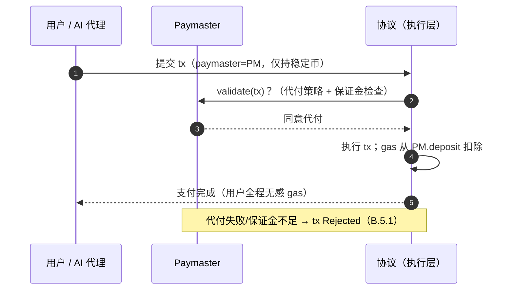

# C.3 策略沙盒与 Paymaster

> **设计状态**：proposed design。WASM 沙盒与 Paymaster 协议为设计方案。

## C.3.1 可验证支付策略沙盒

[C.1](c1-account-abstraction.md) 的可编程验证器与 [C.2](c2-session-keys.md) 的授权谓词，需要一个执行环境。AXON 采用 **WASM 沙盒**运行账户验证逻辑与支付策略。选择 WASM 的理由：成熟、可移植、可确定性化、可精确 gas 计量。

沙盒须满足三条硬性质：

* **确定性（Determinism）**：同一输入必产同一输出。禁用浮点非确定性、系统时间、真随机等不确定源；随机性只能来自链上信标（[A.2.5](a2-cryptography.md)）。确定性是 [B.3.2](b3-state.md) 状态转换 $\delta$ 可重放的前提。
* **gas 计量（Metering）**：每条指令按 gas 计价，执行超预算即中止（[F.1](f1-gas-fees.md)）——防止策略逻辑成为 DoS 向量。
* **能力安全（Capability Security）**：策略代码仅能访问被显式授予的能力（读特定状态、发起受限调用），无环境权限（no ambient authority）。一段支付策略无法越权触碰策略作者未授权的资源。

$$\mathsf{Sandbox} : (\text{code},\ \text{input},\ \text{gas\_limit}) \to (\text{output},\ \text{gas\_used}) \ \big|\ \bot_{\text{OOG}}$$

**可验证性**：因执行确定 + gas 计量，任意节点重放策略执行必得相同结果——你能**证明**代理只会按既定策略行事。这把 [C.2](c2-session-keys.md) 的授权约束从「声明」变为「可验证的强制」。

## C.3.2 Paymaster：费用代付协议

支付体验的最后一道摩擦是 gas：用户/代理须持有原生 gas 代币才能动用稳定币。**Paymaster** 允许第三方（应用方、商户、协议）代付交易 gas，用户/代理无需持有 gas 代币（白皮书 [3.7](../part3-architecture/3-7-account-abstraction.md)）。

交易的 `paymaster` 字段（[C.1.3](c1-account-abstraction.md)）引用一个代付方。执行时的费用主体解析：

```text
resolve_paymaster(tx):
  if tx.paymaster == null: return tx.sender
  pm ← st[tx.paymaster]
  assert pm.validate(tx) == 1          # 代付方策略：是否愿为此 tx 代付
  assert pm.deposit ≥ max_fee(tx)      # 代付方有足额保证金
  return tx.paymaster                   # 由代付方支付 gas
```

## C.3.3 Paymaster 验证时序



## C.3.4 Paymaster 的防滥用

代付方为公共资源，须防被薅：

* **保证金 + 预扣**：代付前锁定 `max_fee`，执行后按实际用量结算，余额退回——保证代付方始终可偿付。
* **代付策略**：`pm.validate` 是代付方自定义谓词（同样跑在沙盒里），可限定「只为白名单应用/特定调用/限额内」代付——防止任意交易白嫖。
* **速率与配额**：代付方可设单用户/单周期配额，抵御 gas 抽干攻击。

## C.3.5 三原语协同

至此，AXON「AI 原生」的三个地基原语闭环：

| 原语 | 作用 | 章节 |
| --- | --- | --- |
| 账户抽象 | 让账户可编程、授权可插拔 | [C.1](c1-account-abstraction.md) |
| 会话密钥 + 策略沙盒 | 给代理有界、可验证、可撤销的付款权 | [C.2](c2-session-keys.md) · 本节 |
| Paymaster | 代理无需管理 gas，专注支付本身 | 本节 |

三者共同实现白皮书 [5.2](../part5-ai/5-2-controlled-execution.md) 的「可控支付执行」——**不是给链加一个 AI 功能，而是让链的授权模型从地基起就假设付款方可能是一台需要被约束的机器**。这套原语同样服务人类用户：带单引擎的**零 Gas 一键跟单**（[E.3.6](e3-copy-trading.md)）即由预测平台作为 Paymaster 代付跟单 gas，用户全程无需感知 gas。

---

*下一节：[D.1 稳定币结算引擎](d1-settlement.md)*
