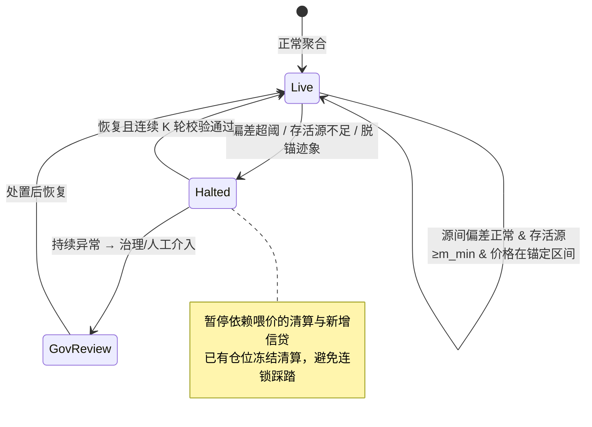

# D.2 预言机与喂价安全

> **设计状态**：proposed design。聚合算法为设计方案，阈值参数待定；预言机合作见白皮书 [6.3](../part6-roadmap/6-3-team-partners.md)。

## D.2.1 喂价是支付链的隐形命门

货币市场清算、信贷抵押率、风险准备金全依赖「1 单位稳定币现在值多少法币」。喂价一旦出错，会触发本不该发生的连锁清算——这是 DeFi 多次「喂价攻击」与「脱锚踩踏」的根源。AXON 的设计哲学：**面对不确定，宁可保守暂停，也不冒险算错。**

## D.2.2 多源聚合

设 $m$ 个独立喂价源在某时刻提供价格 $\{p_1, \dots, p_m\}$。AXON **不用均值**（易被离群值/操纵拉偏），而用**中位数**：

$$\hat{p} = \mathrm{median}(p_1, \dots, p_m)$$

中位数的**崩溃点（breakdown point）为 50%**——少于半数的喂价源被操纵，聚合价格仍稳健。这是抗操纵的第一道防线。

## D.2.3 偏差检测（MAD）

聚合前，用 **MAD（中位数绝对偏差，Median Absolute Deviation）** 识别离群源：

$$\mathrm{MAD} = \mathrm{median}\big(\,|p_i - \hat{p}|\,\big), \qquad z_i = \frac{|p_i - \hat{p}|}{\mathrm{MAD} + \varepsilon}$$

$z_i$ 超过阈值 $\tau_{\text{dev}}$ 的源被标记为离群并**剔除**后再聚合。MAD 比标准差更稳健（不被极端离群值本身污染）。剔除后若**存活源数不足** $m_{\min}$，则触发熔断（下节）——宁可暂停，不用残缺数据结算。

## D.2.4 熔断状态机

喂价系统是一个显式状态机，**在异常时暂停清算/结算而非盲目执行**：

`Halted` 态下，依赖喂价的清算与新增信贷被暂停——一次不该发生的清算所造成的信任损害，远大于一次短暂暂停的不便。

## D.2.5 TWAP 兜底与脱锚保护

* **TWAP fallback**：为抵御瞬时闪价操纵，清算等敏感判定可采用**时间加权平均价（TWAP）**而非瞬时价：

$$\mathrm{TWAP}_{[t-\Delta,\,t]} = \frac{1}{\Delta}\int_{t-\Delta}^{t} \hat{p}(s)\, ds$$

对攻击者，操纵 TWAP 需在整个窗口 $\Delta$ 内持续投入，成本远高于操纵单点。

* **脱锚保护（Depeg guard）**：当稳定币自身对法币锚定出现显著偏离（$|\hat{p} - p_{\text{peg}}| > \tau_{\text{peg}}$）时，触发保护——暂停以该资产计价的清算，避免在异常锚定下强平健康仓位。

## D.2.6 喂价安全总览

| 威胁 | 防线 |
| --- | --- |
| 少数源被操纵 | 中位数聚合（50% 崩溃点） |
| 离群/故障源 | MAD 偏差剔除 + 最小存活源数 |
| 瞬时闪价 | TWAP 时间加权 |
| 稳定币脱锚 | Depeg guard |
| 数据整体异常 | 熔断暂停 + 治理介入 |

喂价安全是 PayFi 货币市场（[E.1](e1-money-market.md)）与清算（[E.2](e2-liquidation.md)）能安全运转的前提——**没有可信的价格，就没有可信的信贷与清算**。

---

*下一节：[D.3 可插拔合规网关](d3-compliance.md)*
