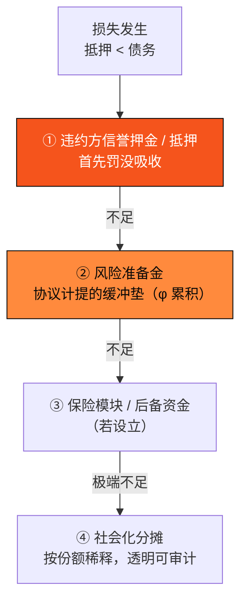

# E.2 信贷风控与清算

> **设计状态**：proposed design（设计模型）。清算参数、准备金比例待治理定，**非收益承诺**。

信贷业务的成败不在「怎么放款」，而在「怎么管风险」。本节给出 AXON PayFi 货币市场（[E.1](e1-money-market.md)）的风控与清算设计。

## E.2.1 清算触发

当仓位健康因子（[E.1.5](e1-money-market.md)）跌破阈值，仓位可被清算：

$$H < 1 \ \Longrightarrow\ \text{可清算}$$

为抗喂价闪价操纵，触发判定采用 TWAP（[D.2.5](d2-oracle.md)）而非瞬时价，并要求喂价系统处于 `Live` 态——若喂价 `Halted`，清算暂停（避免异常价格误伤健康仓位）。

## E.2.2 清算机制

清算把不健康仓位的抵押物折价转让给清算人，偿还债务、恢复池的偿付能力：

```text
Liquidate(position p):
  assert H(p) < 1  and  oracle.state == Live
  repay ≤ closeFactor · Debt(p)          # 单次最多清算比例（避免过度清算）
  seize = repay · (1 + bonus) / price(collateral)   # 清算人获抵押 + 清算奖励
  assert seize ≤ collateral(p)
  transfer: 清算人付 repay 稳定币 → 偿还债务
            协议划转 seize 抵押物 → 清算人
  更新 p；若仍 H<1，可继续（部分清算）
```

* **清算奖励（bonus）**：给清算人的折价激励，确保清算及时发生（市场化清算）。
* **平仓因子（closeFactor）**：单次清算上限比例，避免一次性过度清算冲击价格。

## E.2.3 违约处置瀑布

若抵押不足以覆盖债务（极端行情/坏账），损失按**清偿瀑布（waterfall）** 逐级吸收，保护 LP 本金：



明确的清偿顺序 = 可预期的风险分配。前几级（押金 + 准备金）设计上应覆盖绝大多数情形；社会化分摊是最后手段，且全程链上透明可审计。

## E.2.4 风险准备金

风险准备金 $R$ 由借款利息按准备金因子 $\phi$（[E.1.3](e1-money-market.md)）持续计提：

$$\frac{dR}{dt} = \phi \cdot r_{\text{borrow}}(U) \cdot B$$

准备金充足率 $R / B$ 是池健康的关键指标；治理可据此动态调整 $\phi$、抵押率与利率曲线。准备金是违约瀑布的第二道防线，把小概率坏账的冲击平滑吸收。

## E.2.5 风控层次总览

呼应白皮书 [4.2](../part4-payfi/4-2-money-market.md) 的风控框架，各防线在协议层的落点：

| 风控层 | 机制 | 章节 |
| --- | --- | --- |
| 还款来源真实性 | 现金流自偿（绑定真实应收/支付流） | [E.1.4](e1-money-market.md) |
| 抵押与信誉押金 | 健康因子 $H$ + 罚没 | [E.1.5](e1-money-market.md) |
| 喂价与估值安全 | 多源中位数 + MAD + 熔断 + TWAP | [D.2](d2-oracle.md) |
| 及时清算 | 市场化清算 + 清算奖励 + 平仓因子 | 本节 |
| 损失吸收 | 违约处置瀑布 + 风险准备金 | 本节 |

**PayFi 货币市场的收益扎根于实体经济的真实现金流，而非加密内部的零和博弈**——这是它区别于旁氏结构的根本，也是这套风控设计的意义所在。

> 同一套「明确顺序、真实资金垫、链上可审计」的思路，也支撑着美股带单引擎的保底兜底——其带单准备金池与违约瀑布是本节机制在带单场景的映射（[E.4](e4-reserve-risk.md)）。

---

*下一节：[E.3 美股带单引擎](e3-copy-trading.md)*
