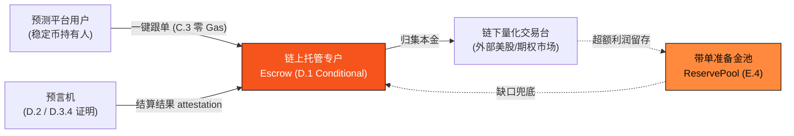
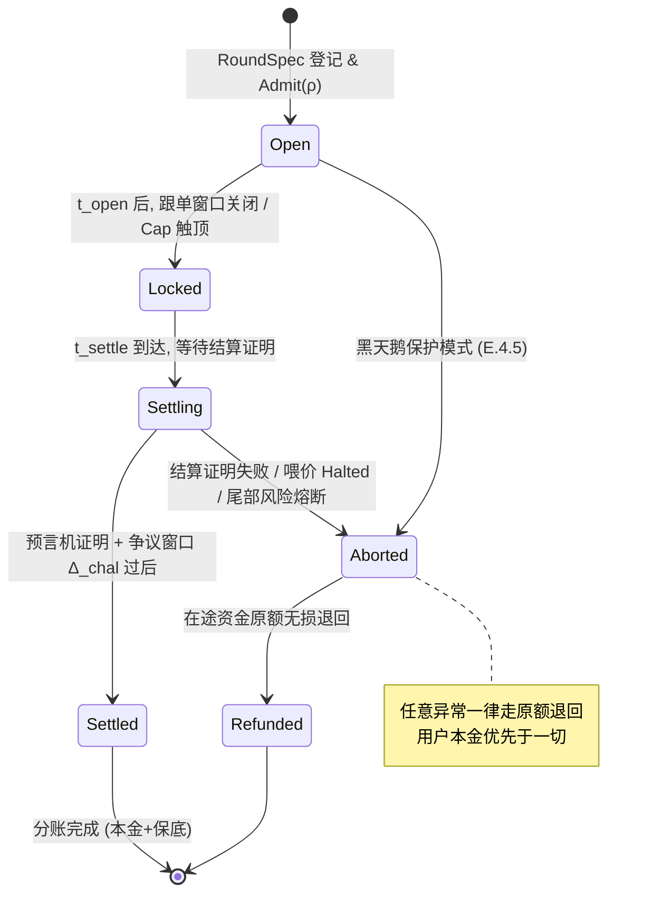

# E.3 美股带单引擎

> **设计状态**：proposed design（协议设计模型）。托管、结算证明与授权机制为设计方案；产品阈值（保底率 1%~3%、等级额度、结算窗口 2–24h）为已定稿产品参数，未指定的协议内部参数（对冲比例、争议窗口长度、注入费率）标 `待定/治理定`。业务侧机制白皮书见 [4.5 美股带单引擎](../part4-payfi/4-5-copy-trading-engine.md)；准备金与风控见 [E.4](e4-reserve-risk.md)。

美股带单引擎是 AXON L1 **首个重磅落地的 PayFi 旗舰产品**。本节把它的产品机制深化到协议规范级：它**不是一套独立的新链上系统**，而是把已有的结算原语（[D.1](d1-settlement.md)）、预言机（[D.2](d2-oracle.md)）、账户抽象与授权（[C.1](c1-account-abstraction.md)–[C.3](c3-policy-paymaster.md)）组装成一个「确定性 PayFi 生息」产品。它对外的确定性收益承诺，由 [E.4](e4-reserve-risk.md) 的准备金与风控在协议层兜底。

## E.3.1 目标与设计边界

引擎把 AXON 团队的链下美股量化能力，封装成预测市场用户可一键使用的**确定性稳定币生息**：用户以稳定币跟单，本金受链上准备金保护，每单获取保底 USDT 收益。

协议层要保证的是三件事——**资金托管的安全性、结算分账的正确性、授权的有界性**；而收益从何而来、如何兜底，是 [E.4](e4-reserve-risk.md) 的偿付与风控问题。二者分离，正是本章与下一章的边界。

## E.3.2 系统模型与参与方

引擎由四个协议角色组成，其中只有**链上托管专户**与**带单准备金池**是链上对象，量化执行发生在链下外部市场：



* **用户（跟单人）**——预测平台上的稳定币持有人，通过账户抽象（[C.1](c1-account-abstraction.md)）与会话密钥授权（[C.2](c2-session-keys.md)）参与。
* **链上托管专户 Escrow**——按场次托管用户本金的合约账户，是 [D.1](d1-settlement.md) 的 `Escrow/Conditional` 结算原语的一个应用实例（E.3.4）。
* **链下量化交易台**——在外部美股/期权市场执行策略。其行为对协议是**外部的**，仅通过预言机证明的结算结果影响链上状态。
* **带单准备金池 ReservePool**——链上资金池，为保底承诺提供兜底（详见 [E.4](e4-reserve-risk.md)）。

**资金隔离不变式**：用户托管资产 $A_u$、量化台自营资产 $A_q$、准备金池 $R_{ct}$ 与协议国库在账户层严格隔离，互不透支：

$$A_u \cap A_q = A_u \cap R_{ct} = \varnothing, \qquad \text{用户可提取额} \leq A_u + (\text{已证明结算收益})$$

量化台自营亏损**不得动用** $A_u$；用户本金的兜底只能来自 $R_{ct}$ 的瀑布（[E.4.5](e4-reserve-risk.md)）。

## E.3.3 带单场次 RoundSpec 与准入谓词

一个「官方带单场次」是一个链上登记的 `RoundSpec`（数据结构见 [附录 III](appendix-datastructures.md)）：

$$\rho = \big(\, \text{asset},\ t_{\text{cat}},\ g,\ \text{Cap},\ \text{tier}_{\min},\ [\,t_{\text{open}}, t_{\text{settle}}\,] \,\big)$$

其中 $t_{\text{cat}}$ 为确定性催化剂时点、$g \in [1\%, 3\%]$ 为保底率、$\text{Cap}$ 为单场跟单总额上限、$\text{tier}_{\min}$ 为最低参与等级、结算窗口 $t_{\text{settle}} - t_{\text{open}} \in [2, 24]\,\text{h}$。

场次登记须通过**准入谓词** $\text{Admit}(\rho)$——协议只承认满足下述四条的场次为「官方带单」，从源头排除劣质标的与单边裸赌：

$$\text{Admit}(\rho) = c_{\text{cat}} \wedge c_{\text{liq}} \wedge c_{\text{hedge}} \wedge c_{\text{short}}$$

| 谓词 | 含义 |
| --- | --- |
| $c_{\text{cat}}$ | 有明确时点的确定性催化剂（头部财报 / CPI / 非农 / 议息），波动率规律性放大 |
| $c_{\text{liq}}$ | 标的为市值前 100 或核心 ETF（SPY/QQQ），进出不砸盘 |
| $c_{\text{hedge}}$ | 可用期权组合（Iron Condor / Straddle）构建对冲，把风险锁进已知区间（[E.4.2](e4-reserve-risk.md)） |
| $c_{\text{short}}$ | 短周期结算（2–24h），不长线占用用户稳定币，保持高频 PayFi 体验 |

## E.3.4 托管生命周期状态机

单场带单是一次 **conditional escrow**（[D.1](d1-settlement.md) 的 `Escrow/Conditional` 原语）：用户本金锁入托管，仅当「预言机证明该场已结算」的释放谓词满足时才分账。生命周期是一个显式状态机：



* **Open**：跟单窗口开启，用户经零 Gas 授权（E.3.6）把稳定币存入托管专户，累计不超过 $\text{Cap}$。
* **Locked**：窗口关闭，本金冻结，量化台在链下执行。
* **Settling**：结算窗口到达，等待预言机结算证明 + 争议窗口 $\Delta_{\text{chal}}$（E.3.5）。
* **Settled**：证明确认，按 E.3.5 分账（本金 + 保底）。
* **Aborted → Refunded**：任何异常路径（证明失败、喂价 `Halted`、尾部风险熔断、黑天鹅保护模式）都**不没收用户本金**，在途资金**原额无损退回**。

**本金优先原则**：状态机的所有异常分支都指向 `Refunded` 而非罚没用户——这是与清算（[E.2](e2-liquidation.md)）最大的不同：清算处置的是借款人的抵押物，而带单托管保护的是跟单人的本金。

## E.3.5 结算与预言机证明

链下量化台在外部市场平仓后，结算结果须经**预言机证明**上链，协议才据此分账。为抵御伪造结算价，证明复用两套既有安全机制：

1. **价格层**（[D.2](d2-oracle.md)）：标的的结算价采用多源中位数 + MAD 剔除；喂价 `Halted` 态下结算暂停（转 `Aborted`），拒绝用残缺数据分账。
2. **结果层**（[D.3.4](d3-compliance.md)）：量化台对「本场结算结果」出具带签名的 attestation $\pi$，经 $\text{Vrf\_attest}(pk_{\text{desk}}, \text{claim}, \pi)$ 验证。

结算证明经过一个**争议窗口** $\Delta_{\text{chal}}$（`待定/治理定`）：窗口内任何守护者可提交反证据挑战结算结果，挑战成立则该场转 `Aborted → Refunded`。窗口过后证明终局，进入分账。

分账在一笔原子 `BatchSettle`（[D.1](d1-settlement.md)）中完成。设某场跟单总额 $P = \sum_i p_i$、保底率 $g$，用户 $i$ 的应得为：

$$\text{payout}_i = p_i \cdot (1 + g)$$

其超额收益 $\Pi = (\text{结算净收益}) - g \cdot P$ 的去向、以及净收益不足 $g\cdot P$ 时的缺口兜底，均由 [E.4](e4-reserve-risk.md) 的偿付模型规范。分账逻辑（说明性伪代码）：

```text
SettleRound(round ρ, attestation π):
  assert state(ρ) == Settling
  assert oracle.state == Live                        # 喂价健康 (D.2)
  assert Vrf_attest(pk_desk, claim(ρ), π)            # 结算结果证明 (D.3.4)
  assert now ≥ ρ.t_settle + Δ_chal  and  not challenged(ρ)   # 争议窗口已过
  net := verified_net_pnl(π)                          # 已证明的链下净收益
  gross_floor := g · P                                # 保底应付总额
  if net < gross_floor:                               # 缺口 → 走准备金瀑布 (E.4.5)
      draw := cover_from_reserve(gross_floor - net)   # 覆盖率约束见 E.4.3
      assert draw succeeds                            # 否则该场此前不应放行 (E.4.3 Ξ≥Ξ_min)
  BatchSettle({ user_i : p_i · (1 + g) for all i })   # 原子分账 (D.1)
  surplus := max(0, net - gross_floor)
  route(surplus)                                      # 利润留存/注入准备金 (E.4.1/E.4.3)
  state(ρ) := Settled
```

分账完成后，用户可即时提现（体验 AXON 亚秒最终性），或点击复利滚存投入下一场（重建一个新 `RoundSpec` 的授权）。

## E.3.6 零 Gas 跟单与有界授权

跟单是**有界授权**（[C.2](c2-session-keys.md)）的一个直接应用：用户授予一个**跟单会话密钥**，其策略 $P_{\text{copy}}$ 把权限精确约束在「带单」这一件事上：

$$P_{\text{copy}} = \big(\, L_{\text{tx}} = \text{单场额度},\ L_{\text{total}} = \text{等级累计上限},\ W = \{\text{托管专户},\ \text{结算合约}\},\ F = \{\text{跟单},\ \text{赎回}\},\ \rho_{\text{rate}} \,\big)$$

授权谓词 $\text{Auth}_{P_{\text{copy}}}$ 直接复用 [C.2](c2-session-keys.md) 的合取判定——任一约束不满足即拒该笔，密钥仍有效。三条安全性质随之继承：**有界**（跟单额度封顶）、**定向**（资金只能进托管/结算合约，去不了别处）、**可撤销**（用户一键退出 = `Revoke(session_id)`，一个区块内生效）。

**零 Gas**：预测平台作为 Paymaster（[C.3](c3-policy-paymaster.md)）代付跟单交易的 gas——用户全程在稳定币语义内操作，无需感知 gas，`resolve_paymaster` 的保证金与配额机制防止代付被抽干。

**等级额度**：用户的链上交互深度决定其单场额度上限 $L_{\text{tx}}$，映射为会话密钥 scope 的 $L_{\text{tx}}$（数值为已定稿产品参数）：

| 等级 | 参与门槛 | 单场额度 $L_{\text{tx}}$ |
| --- | --- | --- |
| 白银 | 普通预测平台用户 | 1,000 USDT |
| 黄金 | AXON 活跃交互者 | 10,000 USDT |
| 钻石 | $AXON 大户 / 节点 | 50,000 USDT |

额度上限的存在，源于「营销预算 + 量化策略容量」的真实上限（[E.4.1](e4-reserve-risk.md)），而非人为稀缺。

## E.3.7 本节机制映射

| 带单机制 | 复用的协议原语 | 章节 |
| --- | --- | --- |
| 按单托管清算 | `Escrow/Conditional` + `BatchSettle` | [D.1](d1-settlement.md) |
| 结算价安全 | 多源中位数 + MAD + 熔断 | [D.2](d2-oracle.md) |
| 结算结果证明 | attestation `Vrf_attest` | [D.3.4](d3-compliance.md) |
| 跟单授权 | 会话密钥策略 $P_{\text{copy}}$ + 撤销 | [C.2](c2-session-keys.md) |
| 零 Gas 跟单 | Paymaster 代付 | [C.3](c3-policy-paymaster.md) |
| 保底兜底 / 覆盖率熔断 | 准备金池 + 违约瀑布 | [E.4](e4-reserve-risk.md) |

带单引擎不重造任何底层机制——它证明了 AXON 地基（结算、预言机、账户抽象）的**可组合性**：一个面向真实用户的旗舰产品，可以完全用既有原语拼装而成。

---

*下一节：[E.4 带单准备金与风控](e4-reserve-risk.md)*
