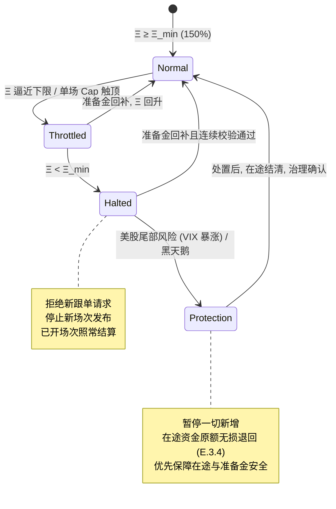
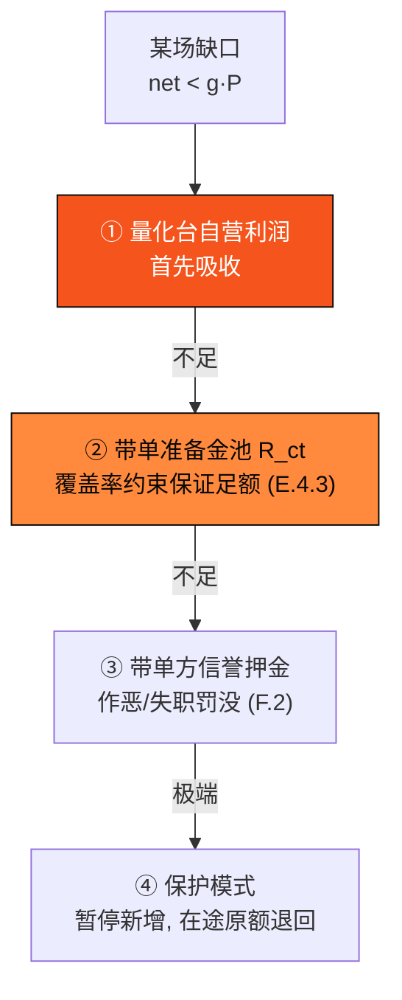

# E.4 带单准备金与风控

> **设计状态**：proposed design（协议设计模型）。偿付与风控机制为设计方案；覆盖率下限（≥150%）与保底率区间（1%~3%）为已定稿产品参数，注入费率、对冲比例等协议内部参数标 `待定/治理定`。本章规范 [E.3 美股带单引擎](e3-copy-trading.md) 的保底如何兑现、风险如何被约束。

[E.3](e3-copy-trading.md) 把带单引擎的托管、结算与授权讲清楚了。本章回答那个最关键的问题：**协议凭什么能兑现「保本 + 保底」？** 答案不是承诺，而是一套可审计的偿付来源加一条链上强制的覆盖率不变式。这与 [E.2 清算](e2-liquidation.md) 保护 LP 本金的思路一脉相承——机制不同（托管兜底 vs 清算瀑布），但「用真实资金垫、按明确顺序吸收损失、全程链上可审计」的哲学一致。

## E.4.1 偿付来源：四支柱

单场保底应付为 $g \cdot P$（保底率 $g$、跟单总额 $P$）。这笔钱来自四层**真实现金流**，按优先级吸收，绝非「新入场者资金付老用户」的旁氏结构：

| 支柱 | 来源 | 角色 |
| --- | --- | --- |
| ① 量化 Alpha | 链下量化台在外部期权/正股市场的结构性套利收益 | 主要收益来源，正常情形即可覆盖保底并留存超额 |
| ② 期权对冲 | 把尾部风险压缩为已知上限（E.4.2） | 不是收益源，而是把「可能亏 100%」变为「最多亏 $X\%$」 |
| ③ 链上真实营收 | 网络 Gas 费、PayFi 结算费按治理定比例 $\phi_{ct}$ 注入准备金（[F.1](f1-gas-fees.md)） | 准备金的持续水源 |
| ④ 生态获客预算 | 把公链获客/空投预算作为「保底补贴」让利给真实用户 | 战略让利，换取真实 TVL 与链上活跃 |

支柱 ① 是收益的正常来源；② 把风险封顶；③④ 构成准备金池（E.4.3）在极端情形下的兜底水源。**协议不假设 ① 永远成立**——正是为此才有 ②③④ 与覆盖率不变式。

## E.4.2 期权对冲：把损失变为已知上限

带单从不单边裸做多/做空。每场在链下券商配置对冲头寸（跨式 / 铁鹰 / 波动率组合），使**单场最大可能损失有界**：

$$\text{MaxLoss}(\rho) \leq \chi \cdot P, \qquad \chi \in (0, 1)$$

其中 $\chi$ 为对冲后的最大回撤比例（`待定/治理定`，由期权组合成本决定）。对冲的意义不在增加收益，而在把无界的尾部风险压成一个**协议可量化、可被准备金覆盖**的常数 $\chi$——这是覆盖率不变式（E.4.3）能成立的前提。

准入谓词 $c_{\text{hedge}}$（[E.3.3](e3-copy-trading.md)）正是要求「必须能构建这样的对冲」，否则该场不予登记。

## E.4.3 带单准备金池与覆盖率不变式

**带单准备金池** $R_{ct}$ 是一个链上资金池，与货币市场的风险准备金（[E.2.4](e2-liquidation.md)）同源设计。其份额记账借用 [E.1.2](e1-money-market.md) 的 rebasing index；其持续水源来自链上营收注入：

$$\frac{dR_{ct}}{dt} = \phi_{ct} \cdot (\text{Gas 费} + \text{PayFi 结算费流}) \;+\; (\text{量化超额留存}) \;+\; (\text{生态预算划入})$$

> 注入比例 $\phi_{ct}$ 是协议参数（治理定）。费用在验证者/国库/准备金间的**分配比例**属代币经济，本黄皮书不展开（与 [F.1.3](f1-gas-fees.md) 口径一致）；本节只规范准备金作为风控缓冲的机制。

核心是一条链上强制的**覆盖率不变式**——它借用 [E.1.5 健康因子](e1-money-market.md) 的思想（准备金之于敞口，正如抵押之于债务）：

$$\Xi = \frac{R_{ct}}{\sum_{\rho \in \text{Open}} \text{MaxLoss}(\rho)} \;\geq\; \Xi_{\min} = 150\%$$

即准备金池必须始终覆盖**所有未结带单的最大可能损失之和的 1.5 倍**。$\Xi$ 之于带单，等价于健康因子 $H$ 之于借贷：

$$\Xi \geq \Xi_{\min} \Rightarrow \text{可开新场}, \qquad \Xi < \Xi_{\min} \Rightarrow \text{熔断（见 E.4.4）}$$

开新场次前，合约校验「加入本场敞口后 $\Xi$ 仍 $\geq \Xi_{\min}$」，否则拒绝登记。这保证了 [E.3.5](e3-copy-trading.md) 分账时 `cover_from_reserve` 一定成功——**缺口在事前就被覆盖率约束挡住了**。

## E.4.4 覆盖率熔断状态机

准备金覆盖率驱动一个显式状态机，异常时**自动缩额乃至暂停**，而非放任敞口膨胀：

* **Normal**：$\Xi \geq \Xi_{\min}$，正常开场。
* **Throttled**：覆盖率逼近下限或单场 $\text{Cap}$ 触顶，自动缩减次日新场次开放额度、提前关闭预测平台侧跟单 API。
* **Halted**：$\Xi < \Xi_{\min}$，拒绝新跟单、停发新场次；**已开场次照常结算**（不牵连在途）。
* **Protection（黑天鹅保护模式）**：美股遭遇熔断级黑天鹅（VIX 暴涨异常）时进入，暂停一切新增，在途资金按 [E.3.4](e3-copy-trading.md) 原额无损退回。

## E.4.5 风控红线、降级与损失吸收瀑布

具体风控红线与触发动作（示例阈值，红线值治理定）：

| 监控项 | 红线 | 触发动作（合约自动执行） |
| --- | --- | --- |
| 全局覆盖率 $\Xi$ | $\geq 150\%$ | 不足 → `Halted`：拒新跟单、停发新场次 |
| 单场跟单总额 | $\leq \text{Cap}$ | 触顶 → 关闭该场预测平台 API 接口 |
| 美股尾部风险 | VIX 暴涨异常 | 场次紧急下架 → `Aborted`，在途资金原额退回 |

当 ① 量化收益不足以覆盖某场保底时，缺口按**损失吸收瀑布**逐级吸收——这是 [E.2.3 违约处置瀑布](e2-liquidation.md) 在带单场景的映射：

覆盖率不变式（E.4.3）保证了前两级在设计上足以吸收绝大多数缺口——这正是「事前约束敞口」相对「事后补救」的价值。带单方（带单员）须质押**信誉押金**（[F.2](f2-staking-slashing.md)），失职/作恶则罚没进准备金池，与货币市场的罚没同一机制。

## E.4.6 风控层次总览

呼应白皮书 [4.5](../part4-payfi/4-5-copy-trading-engine.md)，带单各防线在协议层的落点：

| 风控层 | 机制 | 章节 |
| --- | --- | --- |
| 场次准入 | 确定性催化剂 + 高流动性 + 可对冲 + 短周期 | [E.3.3](e3-copy-trading.md) |
| 风险封顶 | 期权对冲 → 有界最大损失 $\chi \cdot P$ | 本节 E.4.2 |
| 结算真实性 | 预言机多源证明 + 争议窗口 | [E.3.5](e3-copy-trading.md) / [D.2](d2-oracle.md) |
| 敞口约束 | 覆盖率不变式 $\Xi \geq 150\%$ | 本节 E.4.3 |
| 异常暂停 | 熔断状态机 + 黑天鹅保护 | 本节 E.4.4 |
| 损失吸收 | 自营利润 → 准备金 → 罚没 → 保护模式 | 本节 E.4.5 |
| 本金安全 | 一切异常原额无损退回 | [E.3.4](e3-copy-trading.md) |

## E.4.7 隔离、合规与非庞氏论证

* **资金隔离**：用户托管资产、量化台自营资产、准备金池、协议国库在账户层严格隔离（[E.3.2](e3-copy-trading.md) 不变式），互不透支。
* **合规**：带单参与者经可插拔合规网关（[D.3](d3-compliance.md)）做 KYC / 地理围栏 hook；准备金池部署在公开链上地址，资金流入流出 24 小时可审计。
* **非庞氏的协议论证**：收益的每一分都来自 E.4.1 的四支柱（真实量化差价 / 链上真实营收 / 生态预算），**协议不存在「用新跟单者本金支付老跟单者收益」的路径**——新跟单者的本金锁在其自己那一场的托管专户里（[E.3.4](e3-copy-trading.md)），只能用于该场的对冲执行与该用户自己的分账，账户隔离不变式从结构上禁止了旁氏所需的资金挪用。

带单引擎的确定性收益，因此不是一句承诺，而是**「有界损失（E.4.2）+ 足额覆盖（E.4.3）+ 明确吸收顺序（E.4.5）+ 本金优先退回（E.3.4）」四者在协议层的合取**。

---

*下一节：[F.1 Gas 与费用市场](f1-gas-fees.md)*
