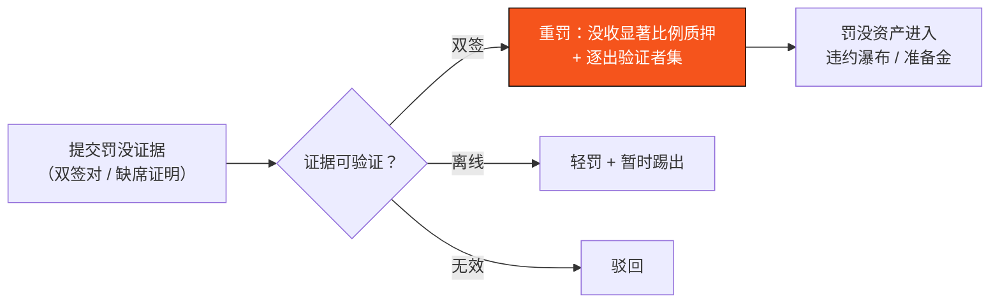

# F.2 质押、验证者经济与罚没

> **设计状态**：proposed design。奖励/罚没率、解绑期为待定参数（[附录 II](appendix-parameters.md)）。本节讲协议级安全经济，不涉及代币供应/分配。

## F.2.1 质押作为安全押金

BFT 共识（[B.1](b1-consensus.md)）的安全性建立在 $S_f < \tfrac{1}{3}S$——即诚实权益占多数。**质押（staking）** 把这条假设经济化：验证者锁定权益作为「作恶押金」，作恶则罚没（slashing）。攻击网络需先掌握 $\geq \tfrac{1}{3}S$ 的质押并承受被罚没的代价，使攻击**在经济上不划算**。

有效权益（[B.2.1](b2-validators.md)）：

$$s_i = s_i^{\text{self}} + \sum_{j} \mathrm{del}_{j \to i}$$

即自有质押加委托。投票权重、奖励与罚没风险都按 $s_i$。

## F.2.2 委托与奖励分配

持币者可委托给验证者（[B.2.5](b2-validators.md)），共享共识奖励、共担 slashing。设验证者 $i$ 一个周期获得共识奖励 $\Pi_i$（奖励来源属代币经济，本节不展开其构成），扣除佣金率 $\kappa_i$ 后按权益份额分配给委托人：

$$\text{委托人 } j \text{ 收益} = (1 - \kappa_i)\cdot \Pi_i \cdot \frac{\mathrm{del}_{j\to i}}{s_i}$$

委托降低了参与门槛、提升去中心化，同时不增加共识投票主体数（委托聚合到验证者名下）。

## F.2.3 罚没条件（Slashing）

罚没针对**可证明的协议违规**。两类核心违规：

**① 等价签名 / 双签（Equivocation）** —— 安全性违规，最严重：

$$\exists\, b \neq b',\ \text{同高度 } h:\quad \mathsf{Sign}_i(b) \wedge \mathsf{Sign}_i(b')$$

验证者对同一高度签署两个冲突区块——这正是 [B.1.5](b1-consensus.md) 安全性论证中假设不会发生的行为。任何人可提交这对矛盾签名作为**不可抵赖的罚没证据**，触发对 $v_i$ 的重罚（罚没其质押的显著比例，甚至全部），并逐出验证者集合。

**② 长期离线 / 不活跃（Downtime）** —— 活性违规，较轻：

$$\text{连续缺席超过 } \Theta \text{ 个区块} \Rightarrow \text{轻罚 + 暂时踢出}$$

用较轻的罚没激励在线率，但不与恶意等同。

## F.2.4 解绑期防逃逸

罚没要有牙齿，作恶者就不能立即撤资。验证者退出后质押进入**解绑期（unbonding period）** $T_{\text{unbond}}$ 才可提取（[B.2.2](b2-validators.md)）：

$$T_{\text{unbond}} > T_{\text{evidence-window}}$$

解绑期须长于罚没证据可被提交的窗口——确保「先发现作恶、后放行撤资」，堵住「作恶后秒撤」的逃逸路径。这是对长程攻击（[F.3](f3-security.md)）的经济防线之一。

## F.2.5 信誉押金（Reputation Bond）

除共识验证者外，承担更高职责的参与方——PayFi 节点、流动性方、高权限 AI 代理——可要求锁定**信誉押金**，作恶/违约则罚没（呼应 [C.2](c2-session-keys.md) 有界授权、[E.2](e2-liquidation.md) 违约瀑布）。这把「行为约束」从纯技术边界延伸到经济激励：**不仅让作恶在技术上被挡住，也让它在经济上不划算**。

## F.2.6 经济安全小结

| 目标 | 机制 |
| --- | --- |
| 攻击成本化 | 质押 = 作恶押金，攻击需 $\geq\tfrac13 S$ 且承受罚没 |
| 安全违规重罚 | 双签可证 → 没收 + 逐出 |
| 活性激励 | 离线轻罚 |
| 防作恶逃逸 | 解绑期 > 证据窗口 |
| 扩展到业务角色 | 信誉押金 + 违约瀑布 |

---

*下一节：[F.3 安全模型与威胁分析](f3-security.md)*
