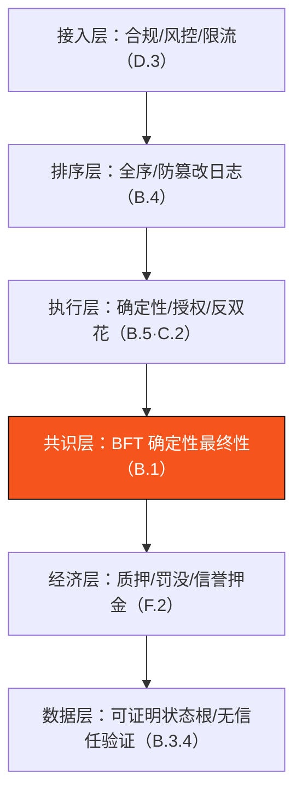

# F.3 安全模型与威胁分析

> **设计状态**：proposed design。威胁分析随实现深化与安全评审持续更新。

本节系统梳理 AXON 的攻击面与对应缓解。每条威胁映射到前文的具体机制——安全不是某一层的特性，而是整条链路协同设计的结果。

## F.3.1 威胁矩阵

| 威胁 | 描述 | 缓解 | 章节 |
| --- | --- | --- | --- |
| **双花** | 同一资金花两次 | nonce + 全序执行 + 余额校验 + 确定性最终性 | [B.5.2](b5-finality.md) |
| **共识分叉** | 冲突区块同时最终确认 | quorum 交集论证（$S_f<\tfrac13S$） | [B.1.5](b1-consensus.md) |
| **长程攻击** | 用旧密钥重写历史 | 弱主观性检查点 + 解绑期 > 证据窗口 | [F.2.4](f2-staking-slashing.md) · 本节 |
| **审查** | 排除某些交易 | 全局 seqNo 公平排队 + VRF 领导者 + 加密内存池（路线） | [B.4](b4-sequencing.md)·[B.2.3](b2-validators.md) |
| **MEV** | 排序操纵套利 | 排序权与出块权分离 + 全序 + 加密内存池 | [B.4.1](b4-sequencing.md) |
| **喂价操纵** | 拉偏价格触发错误清算 | 多源中位数 + MAD + TWAP + 熔断 | [D.2](d2-oracle.md) |
| **代理失控/被劫持** | AI 代理超额/乱付 | 会话密钥有界授权 + 即时撤销 | [C.2](c2-session-keys.md) |
| **DoS** | 资源耗尽 | gas 计量 + 限流 + Paymaster 配额 | [F.1](f1-gas-fees.md)·[D.3](d3-compliance.md) |
| **女巫攻击** | 伪造大量身份 | 权益加权（非节点计数）+ 准入门槛 | [B.2](b2-validators.md) |
| **状态膨胀攻击** | 灌爆状态 | 状态 gas 定价 + 归档/租金 | [B.3.5](b3-state.md)·[F.1.1](f1-gas-fees.md) |
| **伪造带单结算** | 量化台上报假结算结果套利 | 多源结算价 + attestation 证明 + 争议窗口 | [E.3.5](e3-copy-trading.md)·[D.2](d2-oracle.md) |
| **带单方跑路 / 超额** | 带单方失职或挪用 | 信誉押金罚没 + 资金隔离 + 本金优先退回 | [E.4.5](e4-reserve-risk.md)·[E.3.2](e3-copy-trading.md) |
| **准备金挤兑** | 极端行情下敞口超准备金 | 覆盖率不变式 $\Xi\geq150\%$ + 熔断 + 黑天鹅保护 | [E.4.3](e4-reserve-risk.md)·[E.4.4](e4-reserve-risk.md) |

## F.3.2 长程攻击与弱主观性

BFT PoS 的一个经典关注点是**长程攻击（long-range attack）**：攻击者取得过去某时点占多数的旧验证者私钥（彼时已退出、质押已解绑），从历史某点分叉重写一条「看似合法」的链。

AXON 的防线（proposed）：

* **解绑期 > 证据窗口**（[F.2.4](f2-staking-slashing.md)）：作恶验证者的质押在证据可提交期内仍被锁定，双签可被罚没——攻击不是无代价的。
* **弱主观性检查点（weak subjectivity）**：新加入/长期离线的节点从一个近期的、社会共识确认的检查点（而非创世）开始同步。任何早于检查点的「重写历史」都被拒绝。检查点周期须短于解绑期。

弱主观性是 PoS 相对 PoW 的一个务实取舍：以「节点入网时需一个近期可信起点」换取不耗能的确定性最终性——对支付链，这是完全可接受的。

## F.3.3 安全性优先于活性

再次强调 [A.1.4](a1-system-model.md) 的核心取舍：**网络分区等极端情况下，AXON 宁可停止出块（牺牲活性），也不产生冲突确认（保住安全性）**。对支付系统，「暂停」远优于「双花」——短暂不可用可恢复，错误的最终确认不可挽回。喂价熔断（[D.2.4](d2-oracle.md)）、清算暂停（[E.2.1](e2-liquidation.md)）都是这一哲学在各层的体现。

## F.3.4 纵深防御

AXON 的安全不依赖单点，而是**多层冗余**：

任一层被突破，其余层仍提供保护。这种纵深，是支付基础设施公信力的来源——**先用可验证性替代信任，再用去中心化消解信任**。

---

*下一节：[G.1 网络层与交易传播](g1-networking.md)*
